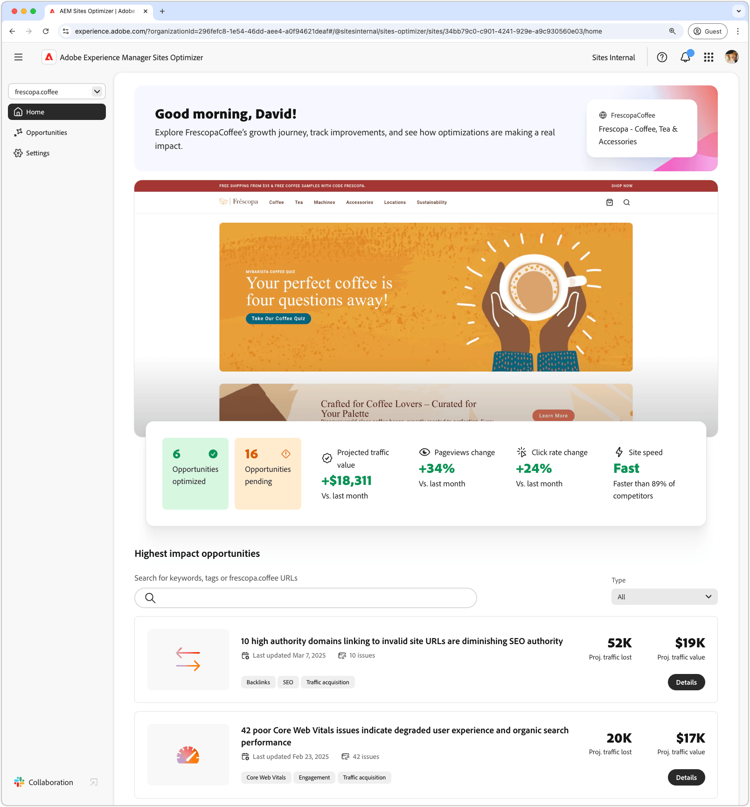
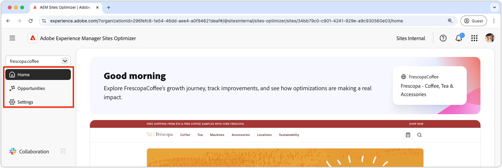
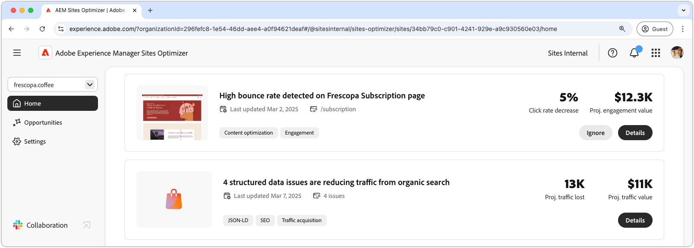

# Sites Optimizer basics

{align="center"}

The Sites Optimizer dashboard provides a high-level overview of your site's performance and opportunities for improvement.

## Domain manager

{align="center"}

The domain manager context menu allows you to choose the AEM site, by domain, you want to assess and optimize. Sites Optimizer provides a list of all the production AEM sites registered in [Cloud Manager](https://experienceleague.adobe.com/en/docs/experience-manager-cloud-service/content/implementing/using-cloud-manager/edge-delivery-sites/add-edge-delivery-site).

## Navigation

{align="center"}

The Navigation section provides quick, persistent access to key areas of the Sites Optimizer from anywhere in Sites Optimizer, including:

* **Home** - The main dashboard, providing a high-level overview of your site's performance and opportunities for improvement.
* **Opportunities** - View and manage the opportunities identified by Sites Optimizer, including those that have been optimized and those that remain unoptimized.
* **Settings** - Configure your Sites Optimizer settings, including the sites you're monitoring and the notifications you receive.

## Site summary

{align="center"}

The Site Summary section provides a snapshot of your site's performance, how Sites Optimizer has improved your site over time, and opportunities for improvement. Key metrics include:

* **Opportunities optimized** – The number of identified opportunities that have been improved to enhance business performance.  
* **Opportunities pending** – The number of potential improvements that remain unoptimized, representing areas for business gains.  
* **Project traffic value** – The change in estimated worth of your website's traffic compared to last month, helping gauge Site Optimizer's contribution to business goals.  
* **Pageviews change** – The percentage shift in how often your site is viewed, reflecting user interest and content effectiveness.  
* **Click rate change** – The percentage change in how often users click, indicating shifts in engagement and conversion potential.  
* **Site speed** – A key indicator of your website's speed and usability, impacting user experience and search rankings.  

## High impact opportunities

{align="center"}

The High Impact Opportunities section highlights the most significant pending opportunities for improvement, based on their potential impact on your site's performance. These opportunities are organized by type, making it easy to prioritize your optimization efforts.

Opportunities can be filtered by keywords, tags, or URLs, or by [opportunity type](../opportunity-types/overview.md) to help you focus on the most critical areas of improvement.

### Opportunity details

{align="center"}

Each opportunity provides a brief description of the issue, its potential impact on your site, and a link to full details. You can also see its status, indicating whether it has been optimized or is still pending.  

* **Opportunity title** – A brief description of the issue and its potential impact on your site's performance.
* **Last updated** – The date the opportunity was last updated by Sites Optimizer with new data.
* **Issue count** - The number of instances of the issue identified on your site.
* **Opportunity type(s)** – The [type(s) of the opportunity](../opportunity-types/overview.md) this opportunity is part of -- such as traffic acquisition, engagement, or site health.

The summary information for each opportunity varies by type and may include details on revenue impact, traffic, user engagement, or security threats.  

To view an opportunity's details, click the **Details** button.  

To exclude an opportunity from the Sites Optimizer dashboard and reports, click the **Ignore** button.  
