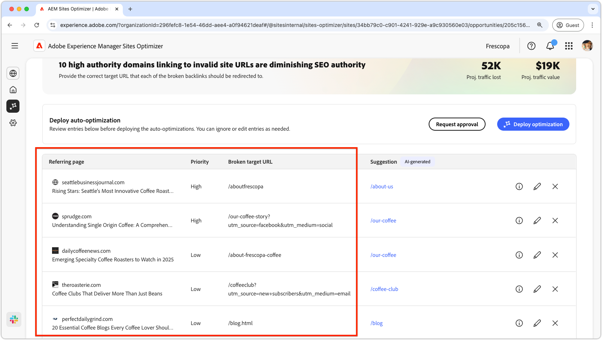
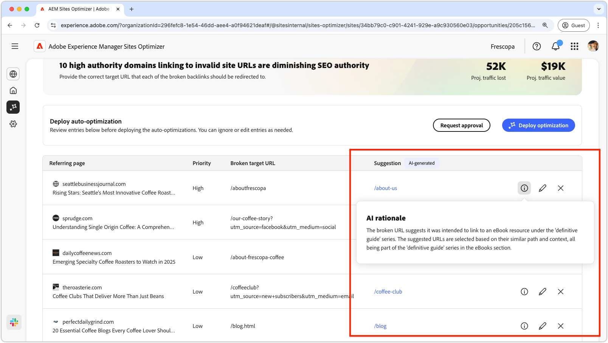
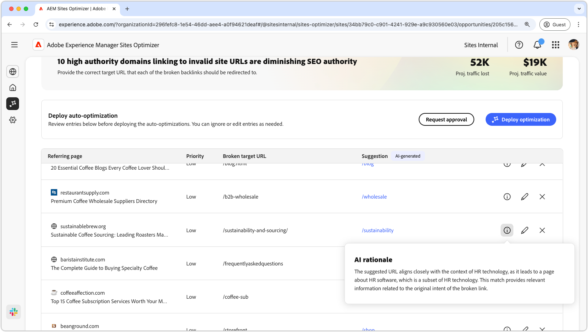
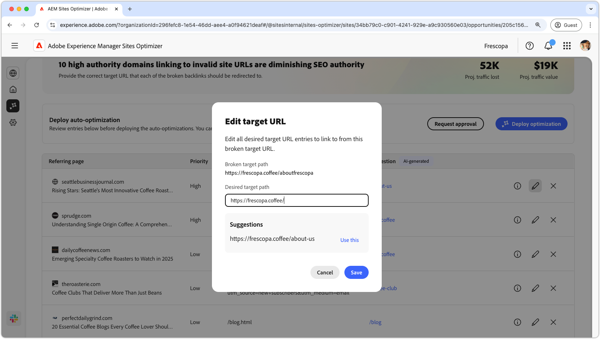
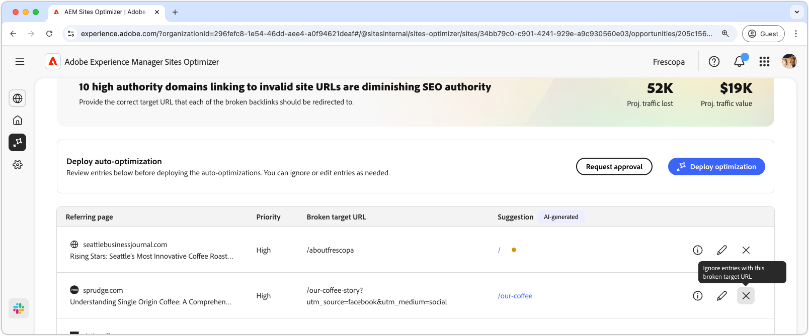
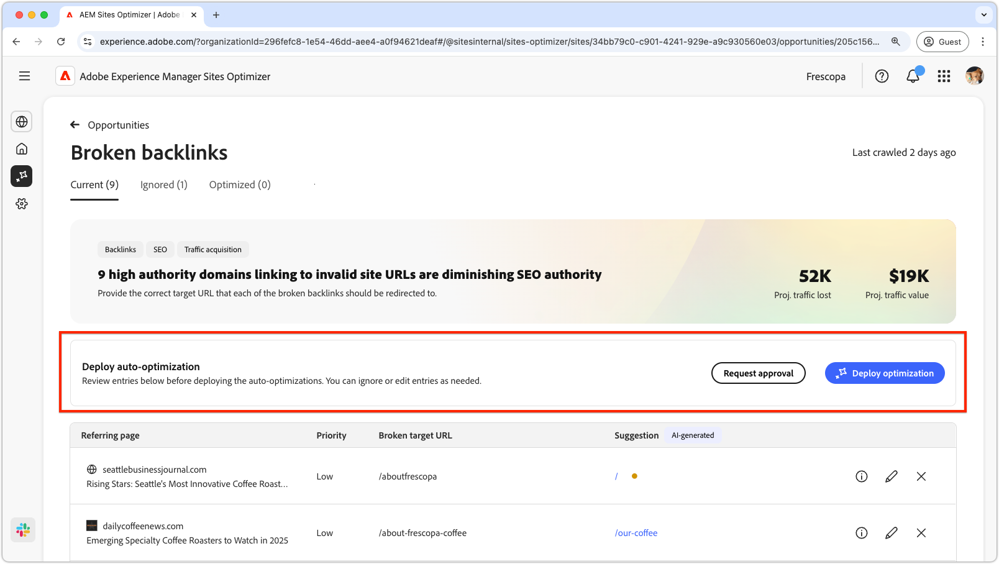
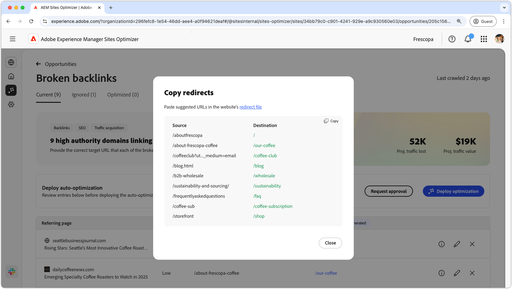
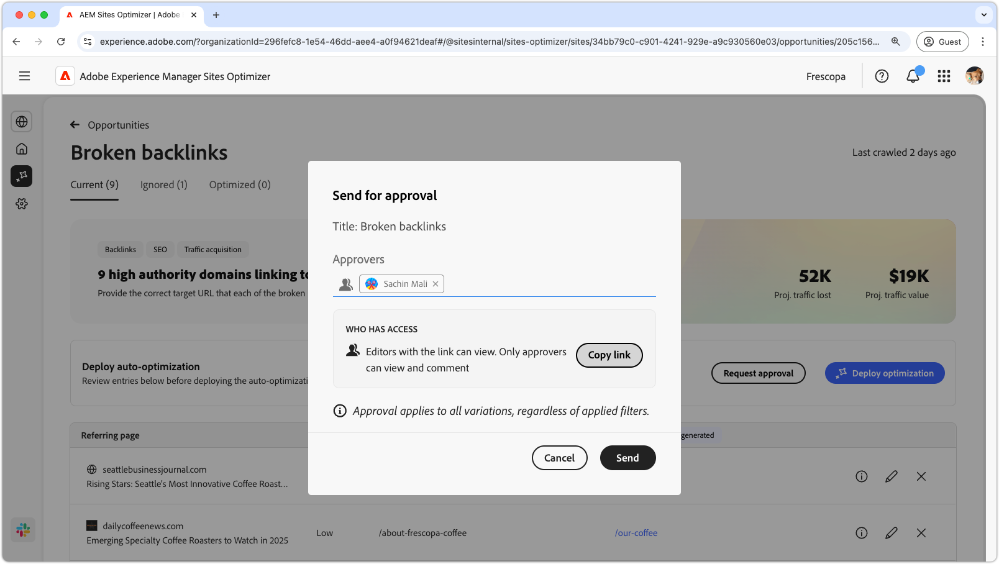

# Broken backlinks opportunity

{align="center"}

The broken backlinks opportunity identifies links from other websites to your site that lead to a 404 error. Since search engines use backlinks to determine search relevance, broken links can negatively impact your site's SEO and discoverability. These issues can arise from factors such as URL changes or the removal of the linked page.

The broken backlinks opportunity displays a summary at the top of the page, including a synopsis of the problem and its impact on your site and business.

* **Projected traffic lost** – The estimated traffic loss due to broken backlinks.
* **Projected traffic value** – The estimated value of the lost traffic.

## Auto-identify

{align="center"}{align="center"} 

The broken backlinks opportunity lists out all the broken backlinks on your site, including the:

* **Referring page** – The website domain that contains the broken link.
* **Priority** – High, medium, or low, indicating the impact the broken link has on SEO based on TODO.
* **Broken target URL** – The non-existing URL on your site that is being linked to.

## Auto-suggest

{align="center"}

The broken backlinks opportunity also provides an AI-generated suggestions on which page on your website the broken URL should redirect to. The suggestions are based on the text that comprises the broken URL, and the content of the suggested page.

>[!BEGINTABS]

>[!TAB AI rationale]

{align="center"}

Select the **information** icon to view the AI rationale for the suggested URL. The rationale explains why the AI believes the suggested URL is the best fit for the broken link. This can help you understand the AI's decision-making process and make an informed decision on whether to accept or reject the suggestion.

>[!TAB Edit target URL]

{align="center"}

If you disagree with the AI-generated suggestion, you can edit the suggested URL by selecting the **edit icon**. This allows you to manually input the URL you believe is the best fit for the broken link. Sites Optimizer will also list any other URLs on your site it believes may be a good fit for the broken link.  

>[!TAB Ignore entries]

{align="center"}

You can choose to ignore entires with the broken target URL. Selecting the **ignore icon** removes the broken backlink from the opportunity list. Ignored broken backlinks can be re-engaged from the **Ignored** tab at the top of the opportunity page.

>[!ENDTABS]

## Auto-optimize [!BADGE Ultimate]{type=Positive tooltip="Ultimate"}

{align="center"}

Sites Optimizer Ultimate adds the ability to deploy auto-optimization for broken backlinks. Selecting the **Auto-optimize** button automatically updates the AEM Site's redirect rules to map the **broken target URL** to the **suggested URL**. This ensures website visitors and search bots following the broken links on the **referring pages** are redirected to the correct page on your site, improving SEO and user experience.

>[!BEGINTABS]

>[!TAB Deploy optimization]

{align="center"}

Selecting **Deploy optimization** will update the AEM Site's redirect rules to map the **broken target URL** to the **suggested URL**. This ensures website visitors and search bots following the broken links on the **referring pages** are redirected to the correct page on your site, improving SEO and user experience.

>[!TAB Request approval]

{align="center"}

{{auto-optimize-request-approval}}

>[!ENDTABS]
