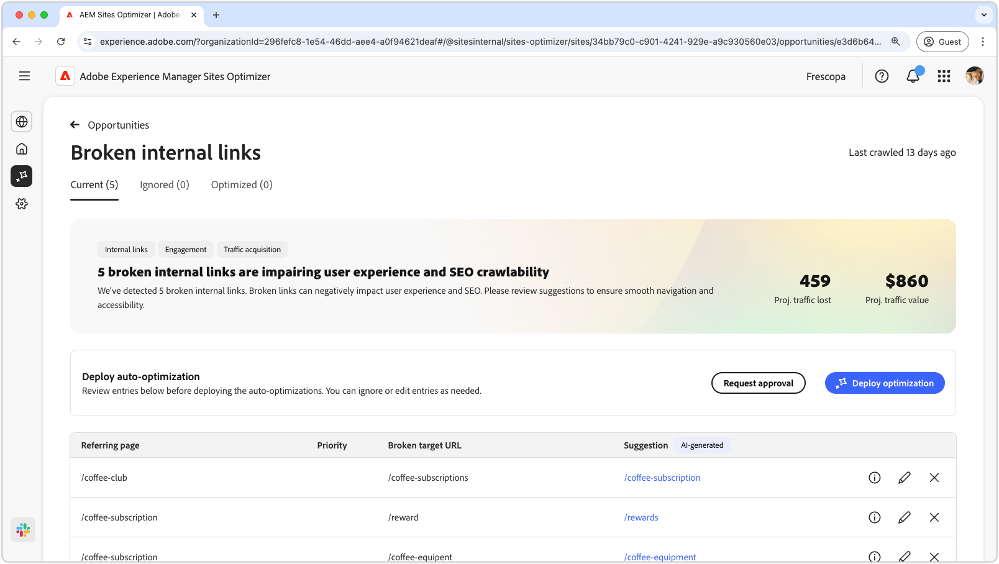

# Invalid or missing metadata opportunity

{align="center"}

Broken internal links impact the search engine's ability to index your site and negatively affect both user experience and search engine optimization. To help fix this problem, the broken internal links opportunity points out broken URLs and provides suggestions for valid link updates. Addressing these issues will improve user engagement and ensure smooth navigation and accessibility.

The broken internal links opportunity displays a summary at the top of the page, including a synopsis of the problem and its impact on your site and business.

* **Projected traffic lost** – The estimated traffic loss due to broken internal links.
* **Projected traffic value** – The estimated value of the lost traffic.

## Auto-identify

<!---{align="center"}-->

The broken internal links opportunity auto-identifies and lists out all the broken internal links on your pages, and includes the following:

* **Referring page** – The page that contains the broken link.
* **Broken Target URL** – The broken internal link.
* **Suggestion** – An AI-generated suggestion on how to update the broken link. See the auto-suggest section for more details.

## Auto-suggest

<!--{align="center"}-->

The broken internal links opportunity provides AI-generated suggestions on how to update the broken links. These suggestions are based on the targeted broken URL and provide a suitable replacement. Selecting the **information icon** provides an AI-generated rationale for the suggested update.

>[!BEGINTABS]

>[!TAB AI rationale]

<!--[AI rationale of broken internal links](./assets/broken-internal-links/auto-suggest-ai-rationale.png) -->

Select the **information** icon to view the AI rationale for the suggested URL. The rationale explains why the AI believes the suggested URL is the best fit for the broken link. This can help you understand the AI's decision-making process and make an informed decision on whether to accept or reject the suggestion.

>[!TAB Edit target URL]

<!--{align="center"}-->

If you disagree with the AI-generated suggestion, you can edit the suggested link value by selecting the **edit icon**. This allows you to manually input the desired link. The edit window contains the **Broken target path** of the link, the **Desired target path** where you can manually edit the link and a field with the Ai-generated suggestion. After you are done editing, click **Save** to update the broken link entry. A yellow dot will appear in the entry field to indicate that the link has been edited.

>[!TAB Ignore entries]

<!--{align="center"}-->

You can choose to ignore entries with the targeted broken URLs. Selecting the **ignore icon** removes the entry from the opportunity list. Ignored entries can be re-engaged from the **Ignored** tab at the top of the opportunity page.

>[!ENDTABS]

## Auto-optimize

[!BADGE Ultimate]{type=Positive tooltip="Ultimate"}

<!---{align="center"}-->

Sites Optimizer Ultimate adds the ability to deploy auto-optimization for the broken links found by the opportunity. <!--- TBD-need more in-depth and opportunity specific information here. What does the auto-optimization do?-->

>[!BEGINTABS]

>[!TAB Deploy optimization]

{{auto-optimize-deploy-optimization-slack}}

>[!TAB Request approval]

{{auto-optimize-request-approval}}

>[!ENDTABS]

