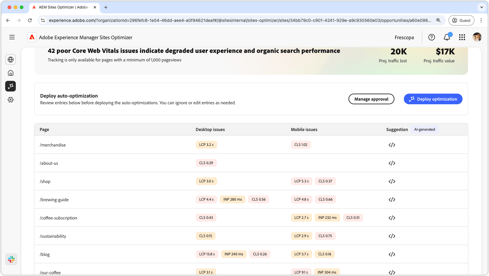
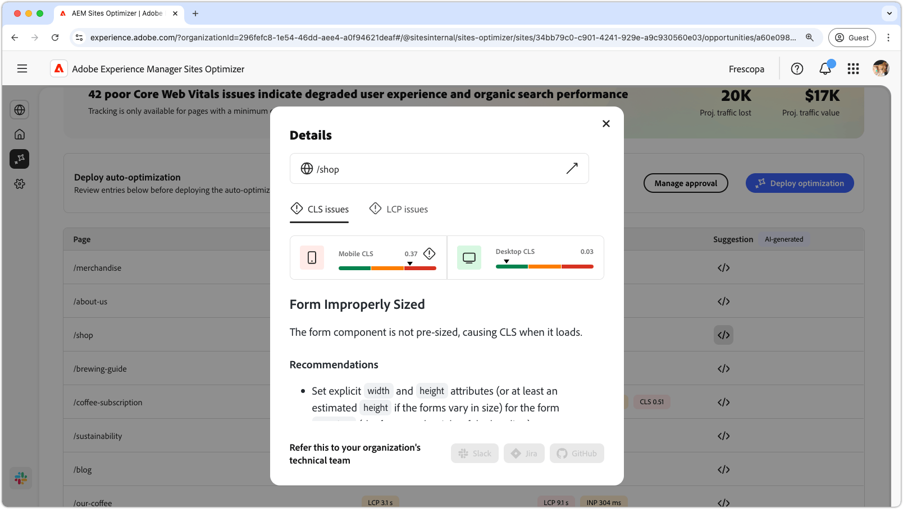
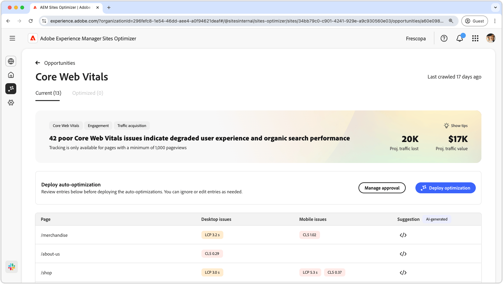

# Core web vitals opportunity

The core web vitals opportunity identifies issues that can degrade the user experience and organic search performance of your web pages. These issues arise from a wide range of factors like: custom fonts, unoptimized javascript dependencies, third-party scripts and so on. The core web vitals opportunity points these faulty elements and suggests fixes that can increase your web page's performance. Please note that only pages that have at least 1000 page views can be analyzed.

To begin, the core web vitals opportunity displays a summary at the top of the page, including a synopsis of the problem and its impact on your site and business.

* **Projected traffic lost** – The estimated traffic loss due core web vitals that are below performance thresholds.
* **Projected traffic value** – The estimated value of the lost traffic.

## Auto-identify

In the lower part of the page, you have a list of all the current issues grouped as:

* **Mobile issues** – A list of issues affecting the mobile version of the page.
* **Desktop issues** – A list of issues affecting the desktop version of the page.

Each issue is displayed in a table, with the **Page** column identifying the affected page entry.

Furthermore, these issues are also grouped by the standard performance metrics of the core web vitals report: largest contentful paint **LCP**, interaction to next paint **INP** and cumulative layout shift **CLS**.

## Auto-suggest

The core web vitals opportunity provides AI-generated fix suggestions. When you click the suggestions button, a new window appears that contains the performance metrics **LCP**, **INP** and **CLS** as categories. You can switch between these categories to see a list of specific issues.

Each category can contain several issues so make sure to scroll down to see the full list of issues and recommendations.  Additionally, there are two performance gages for both mobile and desktop for each metric.

## Auto-optimize [!BADGE Ultimate]{type=Positive url="../licensing.md#sites-optimizer-ultimate" tooltip="Ultimate"}

Sites Optimizer Ultimate adds the ability to deploy auto-optimization for the issues found by the core web vitals opportunity. <!--- TBD-need more in-depth and opportunity specific information here. What does the auto-optimization do?-->

>[!BEGINTABS]

>[!TAB Deploy optimization]

{{auto-optimize-deploy-optimization-slack}}

>[!TAB Request approval]

{{auto-optimize-request-approval}}

>[!ENDTABS]

