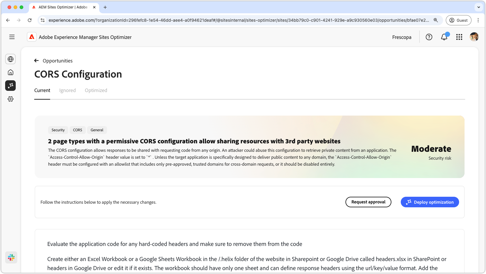
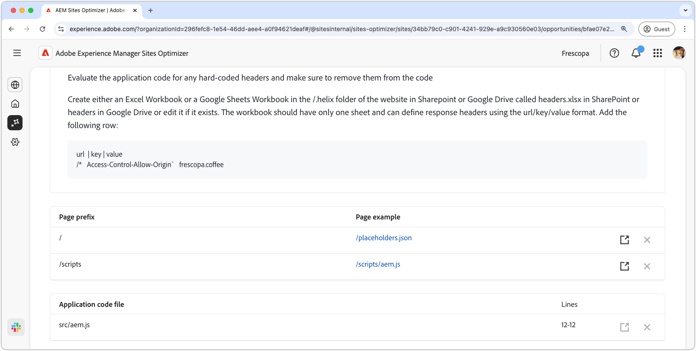

# CORS configuration opportunity

Properly configuring Cross-Origin Resource Sharing (CORS) is essential for securing web applications against unauthorized data access. When the `Access-Control-Allow-Origin` header is set to `*`, any domain can request and receive responses, potentially exposing sensitive information to attackers. This presents an opportunity to strengthen security by implementing a controlled allowlist of trusted domains or disabling CORS where it is not required. Ensuring a secure CORS setup helps protect private content while maintaining seamless access for authorized users.

## Auto-identify

 

Auto-identify scans your website for CORS misconfigurations and detects URLs that are susceptible to unauthorized access. These URLs are listed in the top table, along with the following details:

* **Page prefix** - The URL path prefix that is vulnerable to CORS misconfiguration.
* **Page example** - An example URL that is susceptible to unauthorized access.

## Auto-suggest

Auto-suggest provides of **Application code files** and their **Lines** to be reviewed that may be setting lax CORS policies.

## Auto-optimize [!BADGE Ultimate]{type=Positive url="../licensing.md#sites-optimizer-ultimate" tooltip="Ultimate"}

>[!BEGINTABS]

>[!TAB Deploy optimization]

{{auto-optimize-deploy-optimization-slack}}

>[!TAB Request approval]

{{auto-optimize-request-approval}}

>[!ENDTABS]
