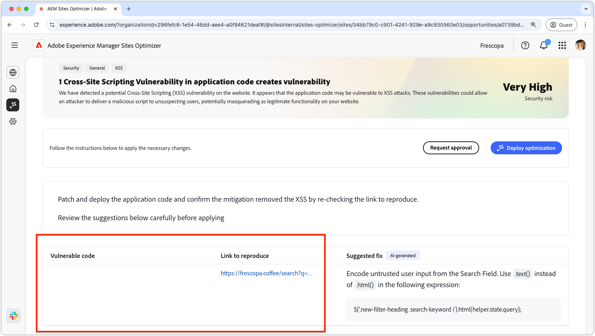
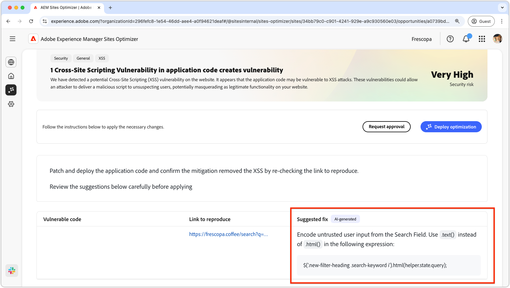

# Cross-site scripting

The broken backlinks opportunity identifies links from other websites to your site that lead to a 404 error. Since search engines use backlinks to determine search relevance, broken links can negatively impact your site's SEO and discoverability. These issues can arise from factors such as URL changes or the removal of the linked page.

The broken backlinks opportunity displays a summary at the top of the page, including a synopsis of the problem and its impact on your site and business. It includes the following:

* **Security risk** – A general assessment of the severity of the risk.

## Auto-identify

 

* **Vulnerable code** 
* **Link to reproduce**

## Auto-suggest

* **Suggested fix** 

## Auto-optimize [!BADGE Ultimate]{type=Positive url="../licensing.md#sites-optimizer-ultimate" tooltip="Ultimate"}

TODO

### Deploy optimization

TODO

### Request approval

TODO
