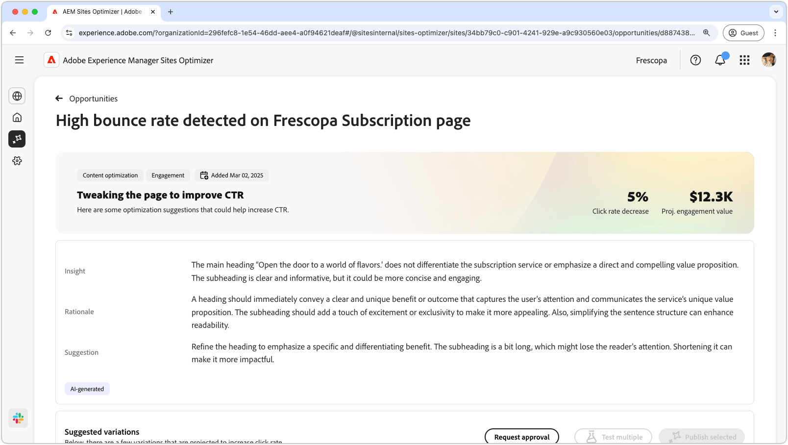
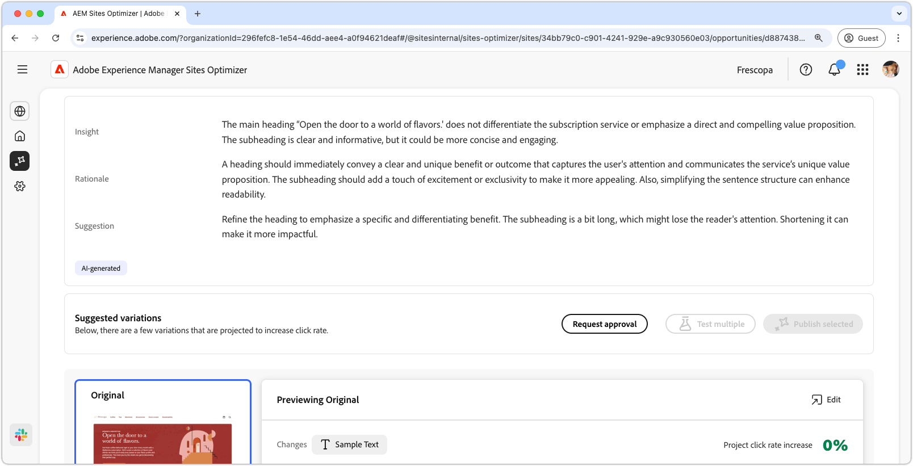
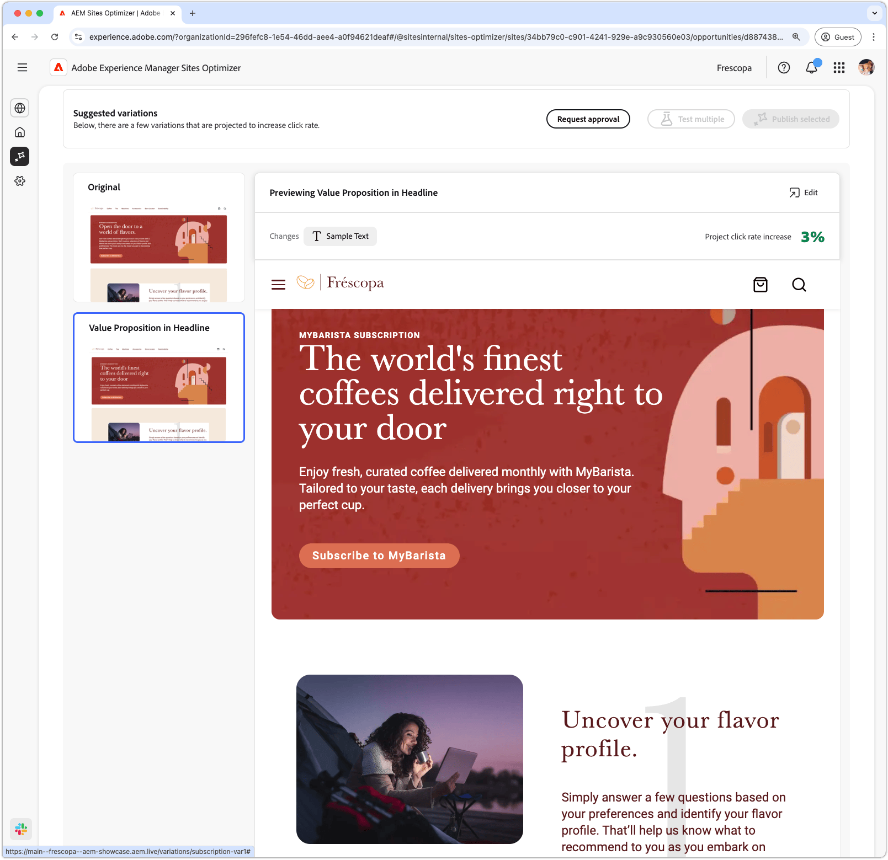
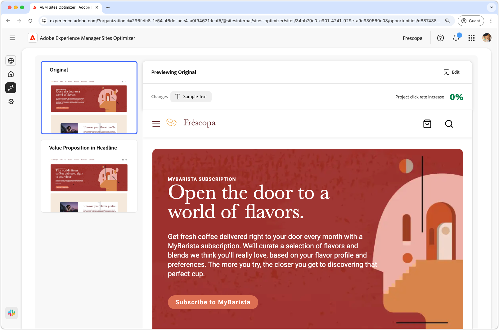
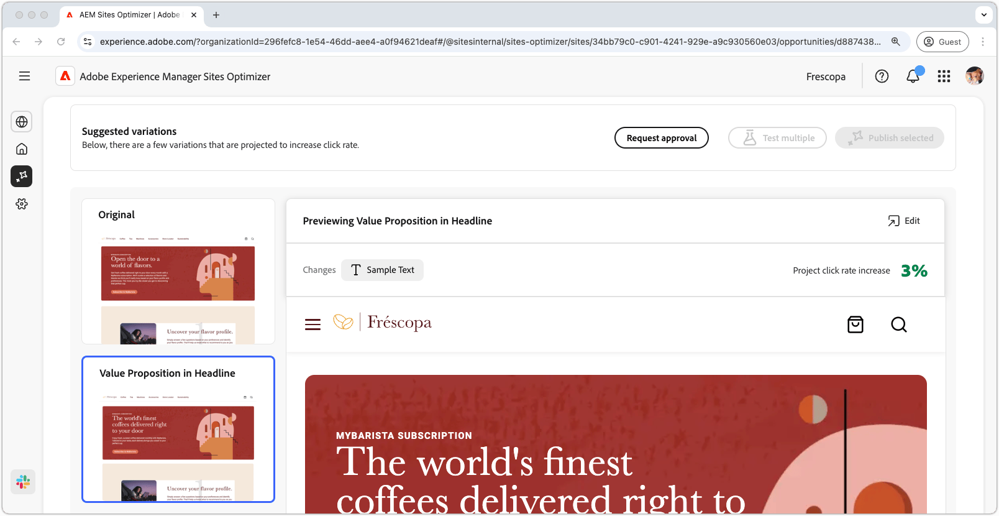

# High bounce rate opportunity

{align="center"}

The high bounce rate opportunity identifies forms on your website that have a high bounce rate. This opportunity helps you understand which forms are not performing well and provides suggestions on how to improve their engagement rates. By optimizing views of your forms, you can increase the number of form submissions and improve the overall performance of your website.

## Auto-identify

{align="center"}

Each webpage with a form with low views is listed as its own **high bounce rate** opportunity. A brief summary of the opportunity, and AI-rationale, is displayed at the top of the opportunity page.

## Auto-suggest

{align="center"}

Auto-suggest provides AI-generated webpage variations that are designed to increase the views of your forms. Each variation displays the **project conversion rate increase** based on its potential to improve form engagement, helping you prioritize the most effective suggestions.

>[!BEGINTABS]

>[!TAB Control variation]

{align="center"}

The control variation is the original form that is currently live on your website. This variation is used as a baseline to compare the performance of the suggested variations.

>[!TAB Suggested variations]

{align="center"}

The suggested variations are AI-generated webpage variations that are designed to decrease the bounce rate of the form. Each variation displays the **projected click rate increase** based on its potential to improve form engagement, helping you prioritize the most effective suggestions.

Click on each variation to preview it on the right side of the screen. In the top of the preview, the following actions and information are available:

* **Changes** - A brief summary of what changed in this variation from the **Control** variation.
* **Projected click rate increase** - The estimated increase in click rate if this variation is implemented.
* **Edit** - Click to edit the variation in AEM authoring.

>[!ENDTABS]

## Auto-optimize

[!BADGE Ultimate]{type=Positive tooltip="Ultimate"}

{align="center"}

Sites Optimizer Ultimate adds the ability to deploy auto-optimization for the issues found by the low views opportunity.

>[!BEGINTABS]

>[!TAB Test multiple]

>[!TAB Publish selected]

{{auto-optimize-deploy-optimization-slack}}

>[!TAB Request approval]

{{auto-optimize-request-approval}}

>[!ENDTABS]
