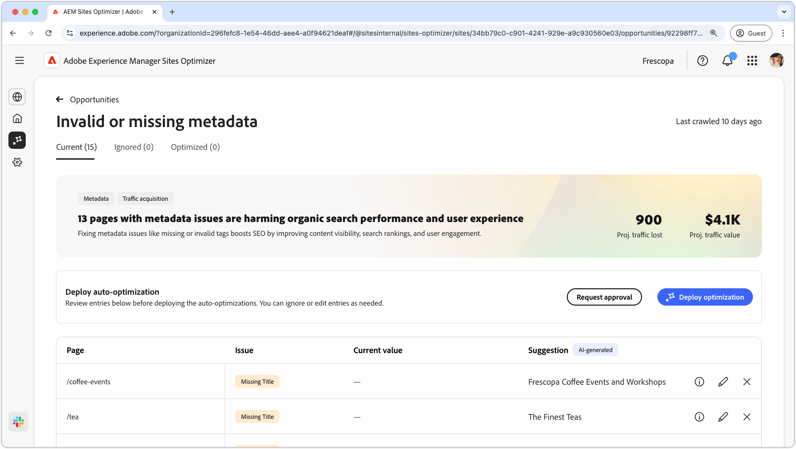
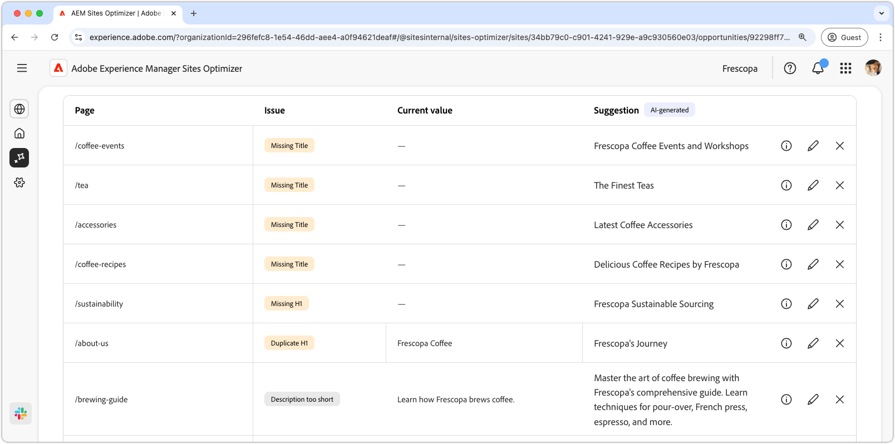
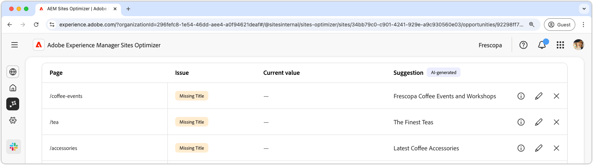
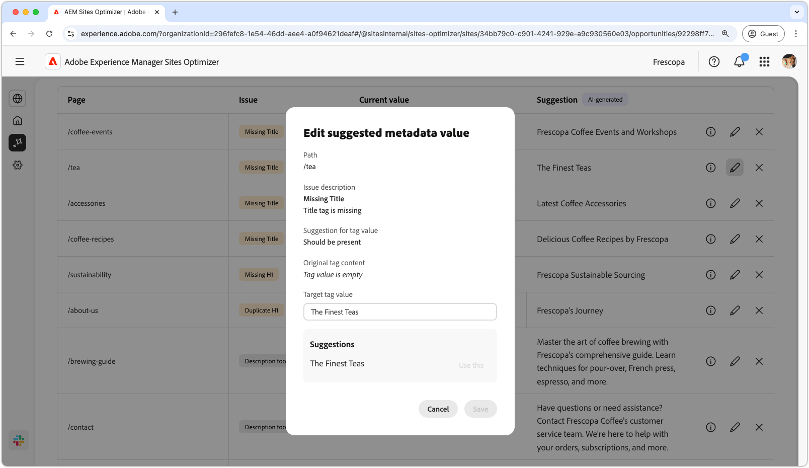
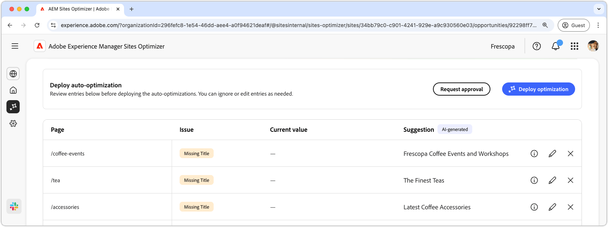

# Invalid or missing metadata opportunity

The invalid or missing metadata opportunity identifies missing or faulty metadata on your web pages. Fixing metadata issues boosts SEO by improving content visibility,search rankings, and user engagement. These issues can arise from factors like missing or invalid tags, descriptions that are too long or too short and so on.

The invalid or missing metadata opportunity displays a summary at the top of the page, including a synopsis of the problem and its impact on your site and business.

* **Projected traffic lost** – The estimated traffic loss due to faulty metadata.
* **Projected traffic value** – The estimated value of the lost traffic.

## Auto-identify

The invalid or missing metadata opportunity lists out all the faulty metadata on your pages, and includes the following:

* **Page** – The page that contains the invalid or missing metadata.
* **Issue** – Indicates the type of issue impacting the metadata tag. These can range from missing titles to duplicate H1's and so on.
* **Value** – The current metadata tag value that needs to be changed.
* **Suggestion** - An AI-generated suggestion for suitable tag updates. See the section below for more details.

## Auto-suggest

The invalid or missing metadata opportunity also provides AI-generated suggestions on how to change or update the metadata tags. These suggestions are based on the initial tag that comprised the faulty metadata, and the content of the suggested update.

>[!BEGINTABS]

>[!TAB AI rationale]

Selecting the **information icon** provides the AI rationale for the suggested update.

>[!TAB  Edit suggested metadata value]

If you disagree with the AI-generated suggestion, you can edit the suggested metadata value by selecting the **edit icon**. This allows you to manually input the value you believe is the best fit for the metadata. The edit window contains the following:

* **Path** – The path to the page that contains the metadata (or lack of).
* **Issue description** – Indicates the type of issue impacting the metadata tag and a short description.
* **Suggestion for tag value** – The AI-generated suggestion on how to change or update the metadata tag. For example how many characters should the tag update contain and so on.
* **Original tag content** - The original tag value.
* **Target tag value** - Edit this field and manually add the desired tag value. When you select **Save** this is the value that will be applied to the proposed update.
* **Suggestion** - The AI-generated suggestion on how to change the value.
* **Save** - Saves and applies the value in the **Target tag value** field.

>[!TAB Ignore entries]

You can choose to ignore entries with the targeted broken or invalid metadata. Selecting the **ignore icon** removes the entry from the opportunity list. Ignored entries can be re-engaged from the **Ignored** tab at the top of the opportunity page.

>[!ENDTABS]

## Auto-optimize [!BADGE Ultimate]{type=Positive url="../licensing.md#sites-optimizer-ultimate" tooltip="Ultimate"}

Sites Optimizer Ultimate adds the ability to deploy auto-optimization for the issues found by the metadata opportunity. <!--- TBD-need more in-depth and opportunity specific information here. What does the auto-optimization do?-->

>[!BEGINTABS]

>[!TAB Deploy optimization]

{{auto-optimization-deploy-optimization-slack}}

>[!TAB Request approval]

{{auto-optimization-request-approval}}

>[!ENDTABS]