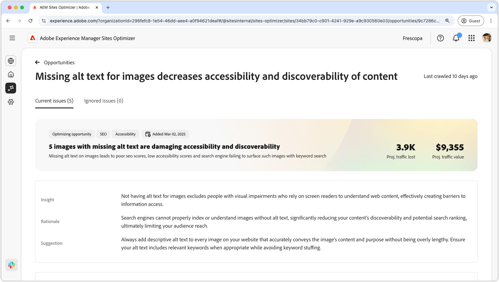
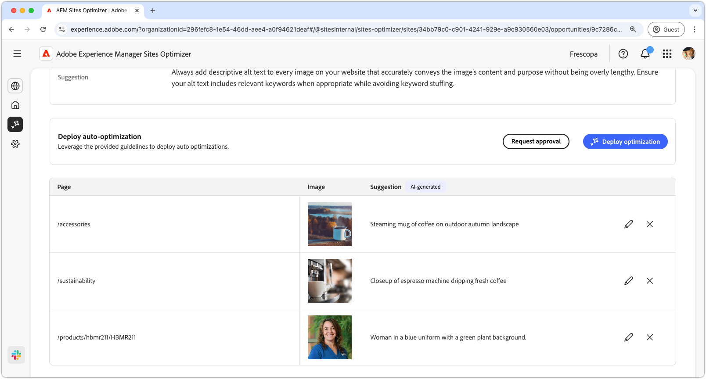
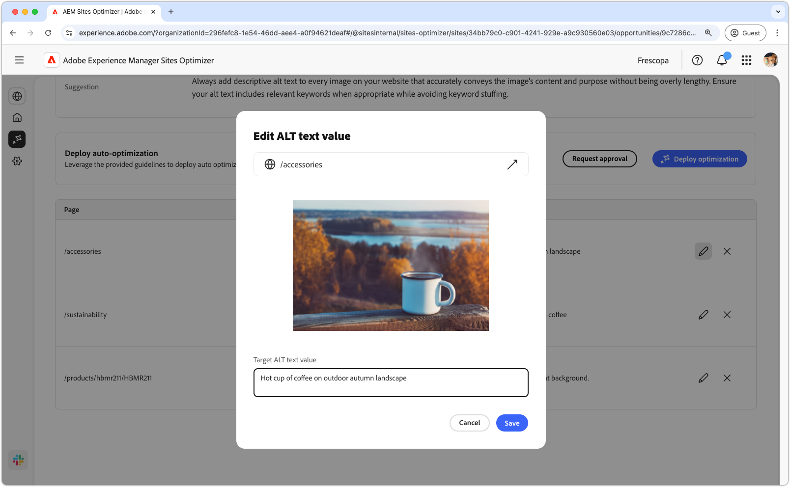
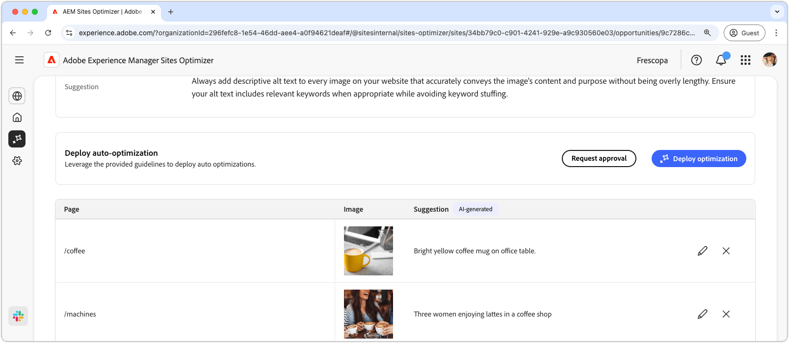

# Missing alt text opportunity

{align="center"}

The missing alt text opportunity identifies images without descriptive alt text on your website. Search engines cannot properly index or understand images without alt text, significantly reducing your content's discoverability and potential search ranking, ultimately limiting your audience reach. Additionally, not having alt text for images excludes people with visual impairments who rely on screen readers to understand web content, effectively creating barriers to information access.

The missing alt text opportunity displays a summary at the top of the page, including a synopsis of the problem and its impact on your site and business.

* **Projected traffic lost** – The estimated traffic loss due to the missing alt text.
* **Projected traffic value** – The estimated value of the lost traffic.

There is also an additional field that displays the rationale, insight and suggestions related to the opportunity.

## Auto-identify

{align="center"}

The missing alt text opportunity lists out all the images on your website that are missing alt text. This section contains the following categories:

* **Page** – The path to the page that contains the missing alt text.
* **Image** – The image that is missing the descriptive alt text.
* **Suggestion** - An AI-generated suggestion for the alt text.

## Auto-suggest

{align="center"}

Auto-suggest provides AI-generated suggestions for the alt text of the images. The AI-generated suggestions are designed to help you quickly add alt text to images without having to manually analyze each image. 

>[!BEGINTABS]

>[!TAB Edit missing alt text]

{align="center"}

If you disagree with the AI-generated suggestion, you can edit the suggested alt text by selecting the **edit icon**. This allows you to manually adjust the text you believe is the best fit for the image. The edit window contains the following:

* **Page path** – A read-only field displaying the path to the page where the missing alt text issue occurs. Click the arrow next to the path to open the corresponding page.  
* **Image** – A read-only preview of the image that requires alt text.  
* **Target ALT text** – An editable field where you can manually enter a descriptive alt text for the image. Ensure the alt text clearly conveys the image's content and purpose concisely. When relevant, include keywords naturally without overloading them.  

>[!TAB Ignore entries]

You can choose to ignore entries in the opportunity list. Selecting the **ignore icon** removes the entry from the list. Ignored entries can be re-engaged from the **Ignored** tab at the top of the opportunity page.

>[!ENDTABS]

## Auto-optimize [!BADGE Ultimate]{type=Positive tooltip="Ultimate"}

{align="center"}

Sites Optimizer Ultimate adds the ability to deploy auto-optimization for the issues found by the missing alt text opportunity. <!--- TBD-need more in-depth and opportunity specific information here. What does the auto-optimization do?-->

>[!BEGINTABS]

>[!TAB Deploy optimization]

{{auto-optimize-deploy-optimization-slack}}

>[!TAB Request approval]

{{auto-optimize-request-approval}}

>[!ENDTABS]
