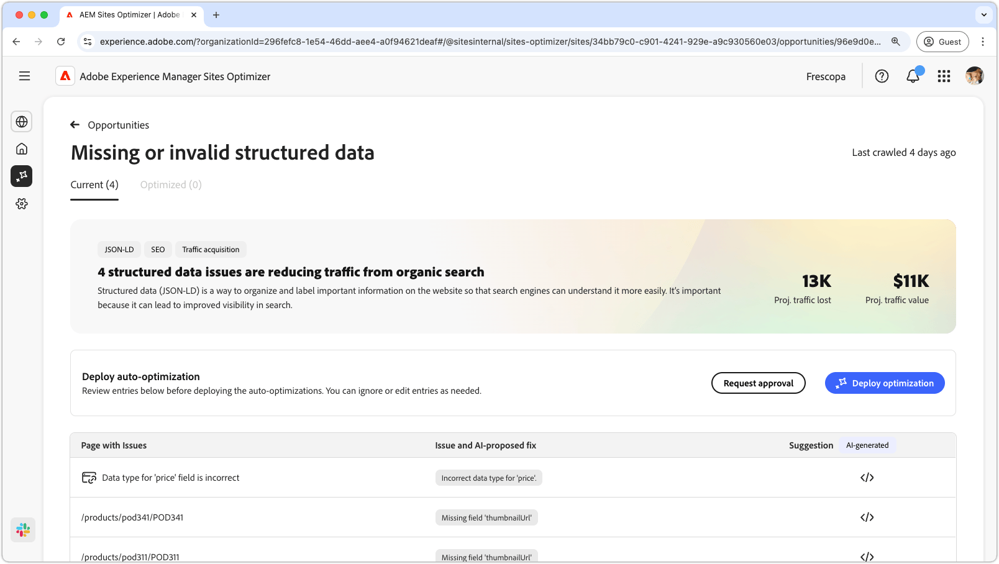
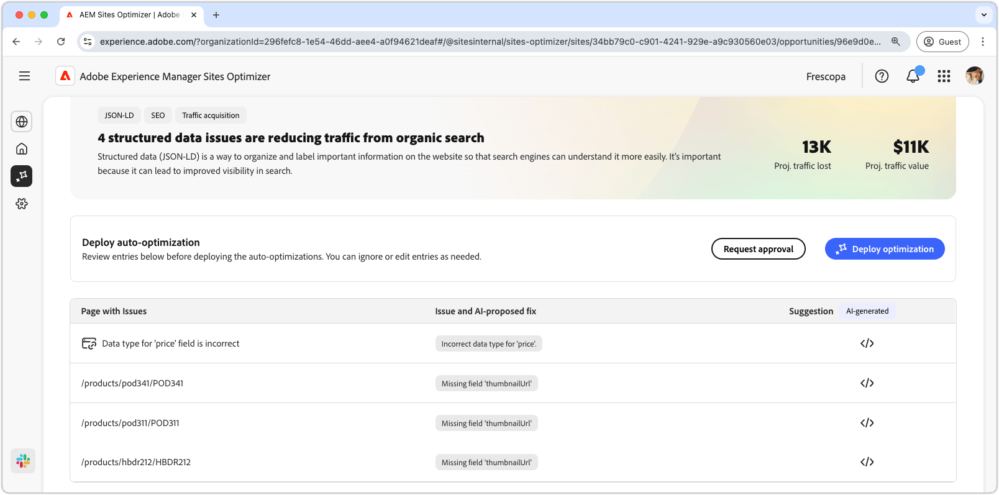
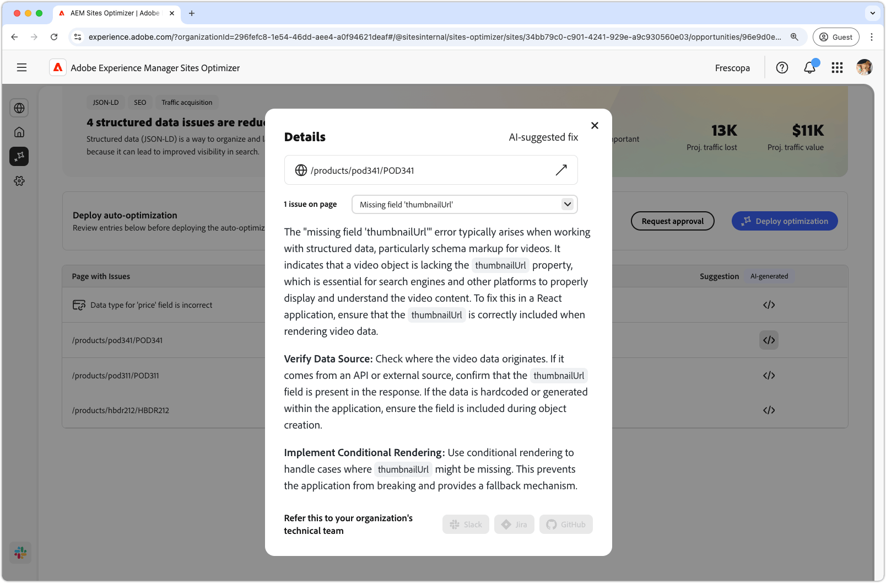
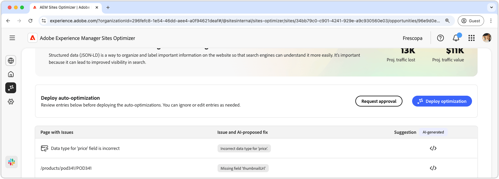

# Missing or invalid structured data opportunity

The missing or invalid structured data opportunity identifies missing or faulty structured data in the Json-LD standardized format. Structured data is a way to organize, describe and label important information on your website. It helps search engines interpret the content of your pages and it leads to improved visibility in search results. Better search results can lead to more users engaging with your website.

The missing or invalid structured data opportunity displays a summary at the top of the page, including a synopsis of the problem and its impact on your site and business.

* **Projected traffic lost** – The estimated traffic loss due to faulty structured data.
* **Projected traffic value** – The estimated value of the lost traffic.

## Auto-identify

The missing or invalid structured data opportunity lists out all the issues detected on your pages, and contains the following categories:

* **Page with issues** – The page that contains the invalid or missing structured data.
* **Issue and AI-proposed fix** – Indicates the type of structured data issue impacting the page.
* **Suggestion** - An AI-generated suggestion for suitable structured data updates. See the section below for more details.

## Auto-suggest

The invalid or missing structured data opportunity also provides AI-generated suggestions on how to change or update the structured data. When you click the suggestions button, a new window appears that contains the following:

* **Page path** – A field that contains the path to the page with invalid or missing structured data.
* **Issues** – A field that contains the number of issues and a drop down menu that lists all the issues.
* **Suggestion field** - An AI-generated description and suggestions for suitable structured data updates. You can scroll down for additional suggestions and issues.

## Auto-optimize [!BADGE Ultimate]{type=Positive url="../licensing.md#sites-optimizer-ultimate" tooltip="Ultimate"}

Sites Optimizer Ultimate adds the ability to deploy auto-optimization for the issues found by the invalid or missing structured data opportunity. <!--- TBD-need more in-depth and opportunity specific information here. What does the auto-optimization do?-->

Selecting **Deploy optimization** will deploy the array of fixes for the targeted web pages. If you are not able to deploy the optimization, you can request approval from your AEM Site's administrator. Selecting **Request approval** will send an email to the AEM Site's administrator with the details of the optimization. The administrator can then approve or reject the optimization from the Sites Optimizer dashboard.
