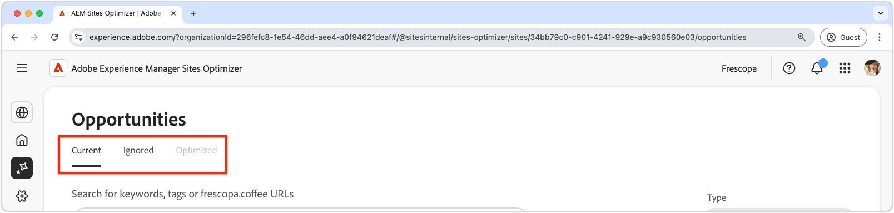
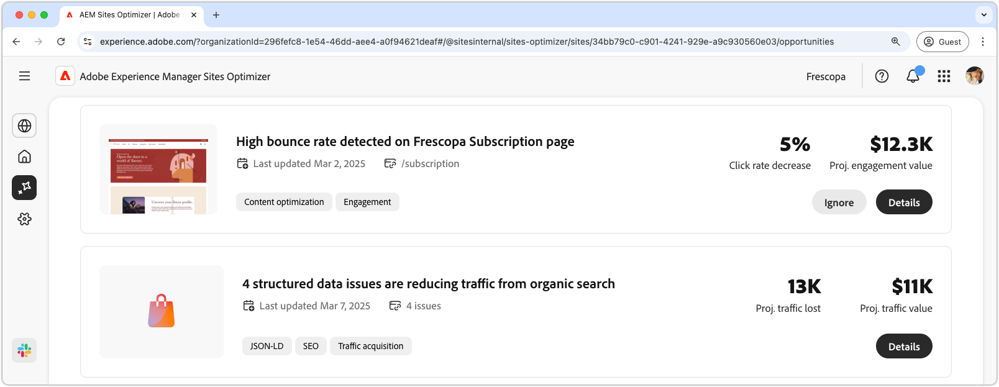

# Opportunities documentation

{align="center"}

Opportunities are available via the **Opportunities** menu option in [Site Optimizer's persistent navigation](../home.md#navigation).

## Opportunity status

{align="center"}

Opportunities can be filtered by status using the tabs across the top:

* **Current** - Opportunities that are currently pending.
* **Ignored** - Opportunities that have been ignored. Ignored opportunities can be re-engaged from this view.
* **Optimized** - Opportunities that have been optimized.

Opportunities can be filtered by keywords, tags, or URLs, or by [opportunity type](../../opportunity-types/overview.md) to help you focus on the most critical areas of improvement.

## Opportunities

With a [opportunity status](#opportunity-status) selected, you can view a list of opportunities. The list of opportunities can be furhter filtered by:

* **Search** - Search of opportunities by **keywords, tags or URLs**.
* **Opportunity type** - Use the **Type** dropdown to filter opportunities by [opportunity type](../../opportunity-types/overview.md).

### Opportunity details

{align="center"}

Each opportunity provides a brief description of the issue, its potential impact on your site, and a link to full details. You can also see its status, indicating whether it has been optimized or is still pending.  

* **Opportunity title** – A brief description of the issue and its potential impact on your site's performance.
* **Last updated** – The date the opportunity the opportunity was last updated, by Sites Optimizer with new data.
* **Issue count** - The number of instances of the issue identified on your site.
* **Opportunity type(s)** – The [type(s) of the opportunity](../../opportunity-types/overview.md), this opportunity is part of -- such as traffic acquisition, engagement, or site health.

The summary information for each opportunity varies by type and may include details on revenue impact, traffic, user engagement, or security threats.  

To view an opportunity's details, click the **Details** button.  

To exclude an opportunity from the Sites Optimizer dashboard and reports, click the **Ignore** button.  

## All opportunities

Explore all the possible opportunities available in Sites Optimizer:

<!-- CARDS
 
* ./broken-backlinks.md
  {title=Broken backlinks}
* ./cross-site-scripting.md
  {title=Cross-site scripting}

--->
<!-- START CARDS HTML - DO NOT MODIFY BY HAND -->

    

        

            

                <figure class="image x-is-16by9">
                    
                </figure>
            

            

                

                    

                        <a href="./broken-backlinks.md" target="_blank" rel="referrer" title="Broken backlinks">Broken backlinks</a>
                    

                    
Learn about the broken backlinks opportunity and how to use it to improve traffic acquisition.

                

                <a href="./broken-backlinks.md" target="_blank" rel="referrer" class="spectrum-Button spectrum-Button--outline spectrum-Button--primary spectrum-Button--sizeM" style="align-self: flex-start; margin-top: 1rem;">
                    Learn more
                </a>
            

        

    

    

        

            

                <figure class="image x-is-16by9">
                    
                </figure>
            

            

                

                    

                        <a href="./cross-site-scripting.md" target="_blank" rel="referrer" title="Cross-site scripting">Cross-site scripting</a>
                    

                    
Learn about the cross-site scripting opportunity and to identify and fix site security vulnerabilities.

                

                <a href="./cross-site-scripting.md" target="_blank" rel="referrer" class="spectrum-Button spectrum-Button--outline spectrum-Button--primary spectrum-Button--sizeM" style="align-self: flex-start; margin-top: 1rem;">
                    Learn more
                </a>
            

        

    

<!-- END CARDS HTML - DO NOT MODIFY BY HAND -->
