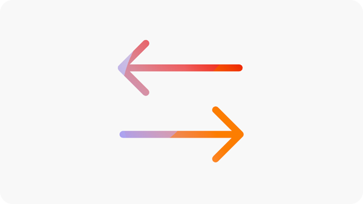
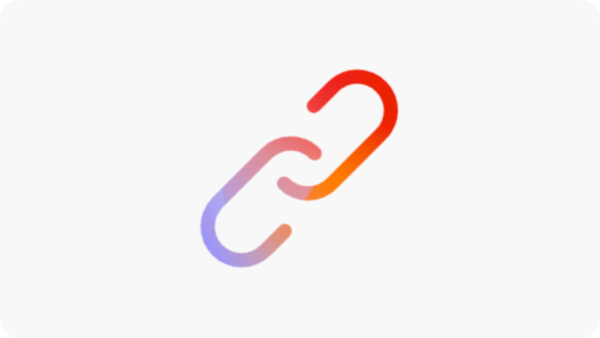
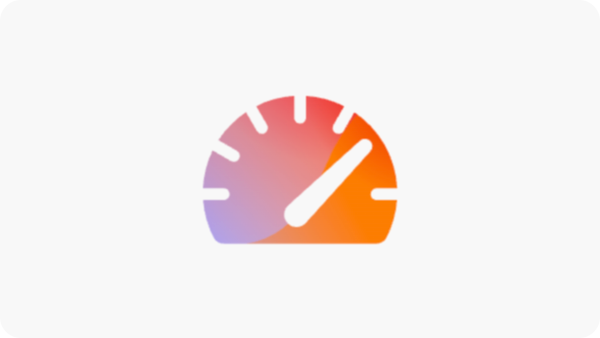
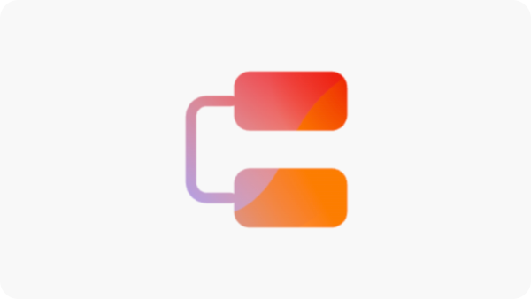

# Opportunities documentation

{align="center"}

Sites Optimizer is comprised as ever-growing set of opportunities powered by Adobe AI, designed to identify and suggest improvements for your website. Each opportunity offers insights into the potential business value, highlights areas that need attention, and provides actionable recommendations for optimization. Click into each opportunity to explore the identified issues, suggested improvements, and step-by-step guidance on how to implement these changes for enhanced website performance and user experience.

Opportunities are available via the **Opportunities** menu option in [Site Optimizer's persistent navigation](../home.md#navigation).

## Opportunity status

{align="center"}

Opportunities can be filtered by status using the tabs across the top:

* **Current** - Opportunities that are currently pending.
* **Ignored** - Opportunities that have been ignored. Ignored opportunities can be re-engaged from this view.
* **Optimized** - Opportunities that have been optimized.

Opportunities can be filtered by keywords, tags, or URLs, or by [opportunity type](../../opportunity-types/overview.md) to help you focus on the most critical areas of improvement.

## Opportunities

With a [opportunity status](#opportunity-status) selected, you can view a list of opportunities. The list of opportunities can be further filtered by:

* **Search** - Search of opportunities by **keywords, tags or URLs**.
* **Opportunity type** - Use the **Type** dropdown to filter opportunities by [opportunity type](../../opportunity-types/overview.md).

### Opportunity details

{align="center"}

Each opportunity provides a brief description of the issue, its potential impact on your site, and a link to full details. You can also see its status, indicating whether it has been optimized or is still pending.  

* **Opportunity title** – A brief description of the issue and its potential impact on your site's performance.
* **Last updated** – The date the opportunity the opportunity was last updated, by Sites Optimizer with new data.
* **Issue count** - The number of instances of the issue identified on your site.
* **Opportunity type(s)** – The [type(s) of the opportunity](../../opportunity-types/overview.md), this opportunity is part of -- such as traffic acquisition, engagement, or site health.

The summary information for each opportunity varies by type and may include details on revenue impact, traffic, user engagement, or security threats.  

To view an opportunity's details, click the **Details** button.  

To exclude an opportunity from the Sites Optimizer dashboard and reports, click the **Ignore** button.  

## All opportunities

Explore all the possible opportunities available in Sites Optimizer:

<!-- CARDS

* ./accessibility-issues.md
  {title=Accessibility issues}
  {image=../../assets/common/card-arrows.png} 
* ./broken-backlinks.md
  {title=Broken backlinks}
  {image=../../assets/common/card-arrows.png}
* ./broken-internal-links.md
  {title=Broken internal links}
  {image=../../assets/common/card-link.png}
* ./cors-configuration.md
  {title=CORS configuration}
  {image=../../assets/common/card-code.png}
* ./core-web-vitals.md
  {title=Core web vitals}
  {image=../../assets/common/card-performance.png}
* ./cross-site-scripting.md
  {title=Cross-site scripting}
  {image=../../assets/common/card-code.png}
* ./invalid-or-missing-metadata.md
  {title=Invalid or missing metadata}
  {image=../../assets/common/card-code.png}
* ./missing-alt-text.md
  {title=Missing alt text}
  {image=../../assets/common/card-arrows.png}
* ./missing-invalid-structured-data.md
  {title=Missing or invalid structured data}
  {image=../../assets/common/card-bag.png}
* ./sitemap-issues.md
  {title=Sitemap issues}
  {image=../../assets/common/card-relationship.png}
* ./website-permissions.md
  {title=Website permissions}
  {image=../../assets/common/card-people.png}
* ./website-vulnerabilities.md
  {title=Website vulnerabilities}
  {image=../../assets/common/card-puzzle.png}

--->
<!-- START CARDS HTML - DO NOT MODIFY BY HAND -->

    

        

            

                <figure class="image x-is-16by9">
                    
                </figure>
            

            

                

                    

                        <a href="./accessibility-issues.md" target="_blank" rel="referrer" title="Accessibility issues">Accessibility issues</a>
                    

                    
Learn about the accessibility issues opportunity and how to use it to increase the security of on your website.

                

                <a href="./accessibility-issues.md" target="_blank" rel="referrer" class="spectrum-Button spectrum-Button--outline spectrum-Button--primary spectrum-Button--sizeM" style="align-self: flex-start; margin-top: 1rem;">
                    Learn more
                </a>
            

        

    

    

        

            

                <figure class="image x-is-16by9">
                    
                </figure>
            

            

                

                    

                        <a href="./broken-backlinks.md" target="_blank" rel="referrer" title="Broken backlinks">Broken backlinks</a>
                    

                    
Learn about the broken backlinks opportunity and how to use it to improve traffic acquisition.

                

                <a href="./broken-backlinks.md" target="_blank" rel="referrer" class="spectrum-Button spectrum-Button--outline spectrum-Button--primary spectrum-Button--sizeM" style="align-self: flex-start; margin-top: 1rem;">
                    Learn more
                </a>
            

        

    

    

        

            

                <figure class="image x-is-16by9">
                    
                </figure>
            

            

                

                    

                        <a href="./broken-internal-links.md" target="_blank" rel="referrer" title="Broken internal links">Broken internal links</a>
                    

                    
Learn about the broken links opportunity and how to use it to improve engagement on your website.

                

                <a href="./broken-internal-links.md" target="_blank" rel="referrer" class="spectrum-Button spectrum-Button--outline spectrum-Button--primary spectrum-Button--sizeM" style="align-self: flex-start; margin-top: 1rem;">
                    Learn more
                </a>
            

        

    

    

        

            

                <figure class="image x-is-16by9">
                    
                </figure>
            

            

                

                    

                        <a href="./cors-configuration.md" target="_blank" rel="referrer" title="CORS configuration">CORS configuration</a>
                    

                    
Learn about the CORS configuration opportunity and to identify and fix site security vulnerabilities.

                

                <a href="./cors-configuration.md" target="_blank" rel="referrer" class="spectrum-Button spectrum-Button--outline spectrum-Button--primary spectrum-Button--sizeM" style="align-self: flex-start; margin-top: 1rem;">
                    Learn more
                </a>
            

        

    

    

        

            

                <figure class="image x-is-16by9">
                    
                </figure>
            

            

                

                    

                        <a href="./core-web-vitals.md" target="_blank" rel="referrer" title="Core web vitals">Core web vitals</a>
                    

                    
Learn about the core web vitals opportunity and how to use it to improve traffic acquisition.

                

                <a href="./core-web-vitals.md" target="_blank" rel="referrer" class="spectrum-Button spectrum-Button--outline spectrum-Button--primary spectrum-Button--sizeM" style="align-self: flex-start; margin-top: 1rem;">
                    Learn more
                </a>
            

        

    

    

        

            

                <figure class="image x-is-16by9">
                    
                </figure>
            

            

                

                    

                        <a href="./cross-site-scripting.md" target="_blank" rel="referrer" title="Cross-site scripting">Cross-site scripting</a>
                    

                    
Learn about the cross-site scripting opportunity and to identify and fix site security vulnerabilities.

                

                <a href="./cross-site-scripting.md" target="_blank" rel="referrer" class="spectrum-Button spectrum-Button--outline spectrum-Button--primary spectrum-Button--sizeM" style="align-self: flex-start; margin-top: 1rem;">
                    Learn more
                </a>
            

        

    

    

        

            

                <figure class="image x-is-16by9">
                    
                </figure>
            

            

                

                    

                        <a href="./invalid-or-missing-metadata.md" target="_blank" rel="referrer" title="Invalid or missing metadata">Invalid or missing metadata</a>
                    

                    
Learn about the invalid or missing metadata opportunity and how to use it to improve traffic acquisition.

                

                <a href="./invalid-or-missing-metadata.md" target="_blank" rel="referrer" class="spectrum-Button spectrum-Button--outline spectrum-Button--primary spectrum-Button--sizeM" style="align-self: flex-start; margin-top: 1rem;">
                    Learn more
                </a>
            

        

    

    

        

            

                <figure class="image x-is-16by9">
                    
                </figure>
            

            

                

                    

                        <a href="./missing-alt-text.md" target="_blank" rel="referrer" title="Missing alt text">Missing alt text</a>
                    

                    
Learn about the missing alt text opportunity and how to use it to improve engagement on your website.

                

                <a href="./missing-alt-text.md" target="_blank" rel="referrer" class="spectrum-Button spectrum-Button--outline spectrum-Button--primary spectrum-Button--sizeM" style="align-self: flex-start; margin-top: 1rem;">
                    Learn more
                </a>
            

        

    

    

        

            

                <figure class="image x-is-16by9">
                    
                </figure>
            

            

                

                    

                        <a href="./missing-invalid-structured-data.md" target="_blank" rel="referrer" title="Missing or invalid structured data">Missing or invalid structured data</a>
                    

                    
Learn about the missing or invalid structured data opportunity and how to use it to improve traffic acquisition.

                

                <a href="./missing-invalid-structured-data.md" target="_blank" rel="referrer" class="spectrum-Button spectrum-Button--outline spectrum-Button--primary spectrum-Button--sizeM" style="align-self: flex-start; margin-top: 1rem;">
                    Learn more
                </a>
            

        

    

    

        

            

                <figure class="image x-is-16by9">
                    
                </figure>
            

            

                

                    

                        <a href="./sitemap-issues.md" target="_blank" rel="referrer" title="Sitemap issues">Sitemap issues</a>
                    

                    
Learn about the sitemap issues opportunity and how to use it to improve traffic acquisition.

                

                <a href="./sitemap-issues.md" target="_blank" rel="referrer" class="spectrum-Button spectrum-Button--outline spectrum-Button--primary spectrum-Button--sizeM" style="align-self: flex-start; margin-top: 1rem;">
                    Learn more
                </a>
            

        

    

    

        

            

                <figure class="image x-is-16by9">
                    
                </figure>
            

            

                

                    

                        <a href="./website-permissions.md" target="_blank" rel="referrer" title="Website permissions">Website permissions</a>
                    

                    
Learn about the website permissions opportunity and how to use it to increase the security of on your website.

                

                <a href="./website-permissions.md" target="_blank" rel="referrer" class="spectrum-Button spectrum-Button--outline spectrum-Button--primary spectrum-Button--sizeM" style="align-self: flex-start; margin-top: 1rem;">
                    Learn more
                </a>
            

        

    

    

        

            

                <figure class="image x-is-16by9">
                    
                </figure>
            

            

                

                    

                        <a href="./website-vulnerabilities.md" target="_blank" rel="referrer" title="Website vulnerabilities">Website vulnerabilities</a>
                    

                    
Learn about the website vulnerabilities opportunity and how to use it to increase the security of on your website.

                

                <a href="./website-vulnerabilities.md" target="_blank" rel="referrer" class="spectrum-Button spectrum-Button--outline spectrum-Button--primary spectrum-Button--sizeM" style="align-self: flex-start; margin-top: 1rem;">
                    Learn more
                </a>
            

        

    

<!-- END CARDS HTML - DO NOT MODIFY BY HAND -->

