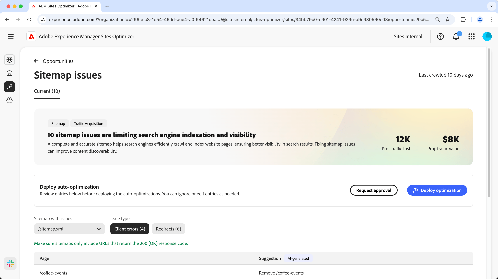
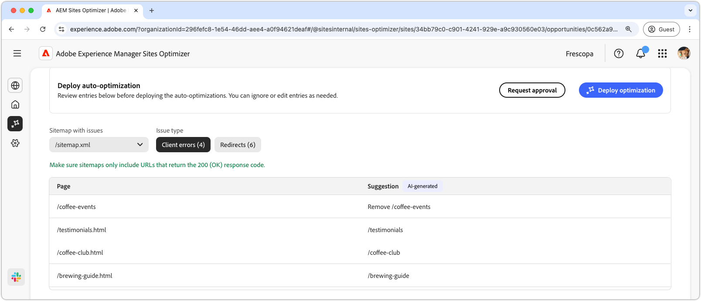
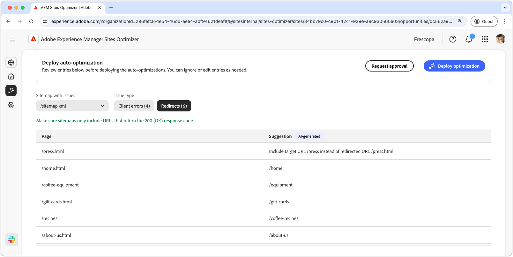
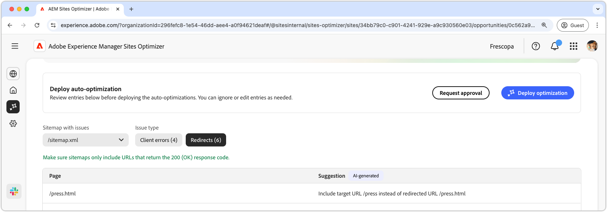

# Sitemap issues opportunity

A complete and accurate sitemap helps search engines efficiently crawl and index website pages, ensuring better visibility in the search results. The sitemap opportunity identifies potential issues with your sitemap. Fixing these issue can greatly improve search engine indexation and content discoverability on your site.

A summary is displayed at the top of the page, including a synopsis of the problem and its impact on your site and business.

* **Projected traffic lost** – The estimated traffic loss due to sitemap issues.
* **Projected traffic value** – The estimated value of the lost traffic.

## Auto-identify

Sitemap issues can be filtered using the following criteria:  

* **Sitemap with issues** – The analyzed sitemap URL containing potential issues.  
* **Issue type** – The type of issue identified in the sitemap:  
  * **Client errors** – Entries that do not return a `200 Success` response.  
  * **Redirects** – Faulty or misconfigured redirects.  

>[!BEGINTABS]

>[!TAB Client errors]

  

 If URLs in your sitemap return these, search engines may assume your sitemap is outdated or that pages were mistakenly removed. Client indicate that the request from the client (browser or crawler) was invalid. Common ones include:

* **404 Not Found** – The requested page doesn't exist.
* **403 Forbidden** – The server denies access to the requested page.
* **410 Gone** – The page was intentionally removed and won't return.
* **401 Unauthorized** – Authentication is required but not provided.

These errors can harm SEO, especially if important pages return **404 or 410**, as search engines may de-index them.

Each issue is displayed in a table, with the **Page** column identifying the affected sitemap entry:  

* **Page** – The URL of the sitemap entry with an issue.  

>[!TAB Redirects]

  

Sitemaps should only include final destination URLs, not ones that redirect. Redirects are meant to guide users and crawlers to the correct location but can cause problems if misconfigured:

* **302 Found (Temporary Redirect)** – Can cause SEO issues if mistakenly used instead of a **301**.
* **307 Temporary Redirect** – Similar to 302 but preserves the HTTP method.
* **Redirect Loops** – When a page redirects back to itself or creates an infinite loop.
* **Broken Redirects** – When a redirect leads to a non-existent or 4xx page.

Each issue is displayed in a table, with the **Page** column identifying the affected sitemap entry:  

* **Page** – The URL of the sitemap entry with an issue.  

>[!ENDTABS]

## Auto-suggest  

Each sitemap issue [that meets the filter criteria](#auto-identify), is listed in a table with the following columns:  

* **Page** – The URL of the sitemap entry with an issue.  
* **Suggestion** – The recommended fix for the issue.  

Suggestions typically include an updated site path to correct the sitemap entry. In some cases, they may also provide more detailed instructions, such as specifying the correct redirect target.  

## Auto-optimize [!BADGE Ultimate]{type=Positive url="../licensing.md#sites-optimizer-ultimate" tooltip="Ultimate"}

Sites Optimizer Ultimate adds the ability to deploy auto-optimization for faulty sitemaps. <!--- TBD-need more in-depth and opportunity specific information here. What does the auto-optimization do?-->

>[!BEGINTABS]

>[!TAB Deploy optimization]

{{auto-optimize-deploy-optimization-slack}}

>[!TAB Request approval]

{{auto-optimize-request-approval}}

>[!ENDTABS]