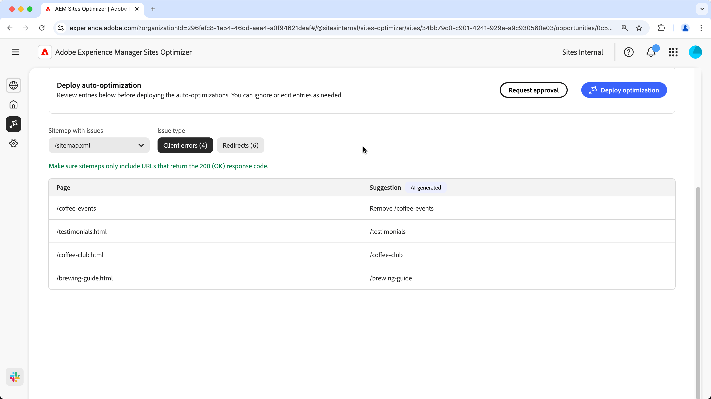

# Sitemap issues opportunity

A complete and accurate sitemap helps search engines efficiently crawl and index website pages, ensuring better visibility in the search results. The sitemap opportunity identifies potential issues with your sitemap. Fixing these issue can greatly improve search engine indexation and content discoverability on your site.

A summary is displayed at the top of the page, including a synopsis of the problem and its impact on your site and business.

* **Projected traffic lost** – The estimated traffic loss due to sitemap issues.
* **Projected traffic value** – The estimated value of the lost traffic.

## Auto-identify

  

Sitemap issues can be filtered using the following criteria:  

* **Sitemap with issues** – The analyzed sitemap URL containing potential issues.  
* **Issue type** – The type of issue identified in the sitemap:  
  * **Client errors** – Entries that do not return a `200 Success` response.  
  * **Redirects** – Faulty or misconfigured redirects.  

Each issue is displayed in a table, with the **Page** column identifying the affected sitemap entry:  

* **Page** – The URL of the sitemap entry with an issue.  

## Auto-suggest  

Each sitemap issue [that meets the filter criteria](#auto-identify), is listed in a table with the following columns:  

* **Page** – The URL of the sitemap entry with an issue.  
* **Suggestion** – The recommended fix for the issue.  

Suggestions typically include an updated site path to correct the sitemap entry. In some cases, they may also provide more detailed instructions, such as specifying the correct redirect target.  

## Auto-optimize [!BADGE Ultimate]{type=Positive url="../licensing.md#sites-optimizer-ultimate" tooltip="Ultimate"}

Sites Optimizer Ultimate adds the ability to deploy auto-optimization for faulty sitemaps. <!--- TBD-need more in-depth and opportunity specific information here. What does the auto-optimization do?-->

Selecting **Deploy optimization** will update the AEM Site's sitemap. If you are not able to deploy the optimization, you can request approval from your AEM Site's administrator. Selecting **Request approval** will send an email to the AEM Site's administrator with the details of the optimization. The administrator can then approve or reject the optimization from the Sites Optimizer dashboard.
