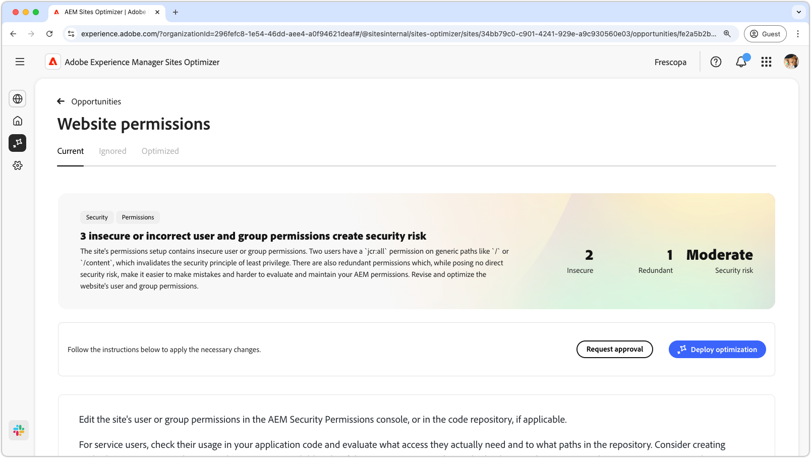
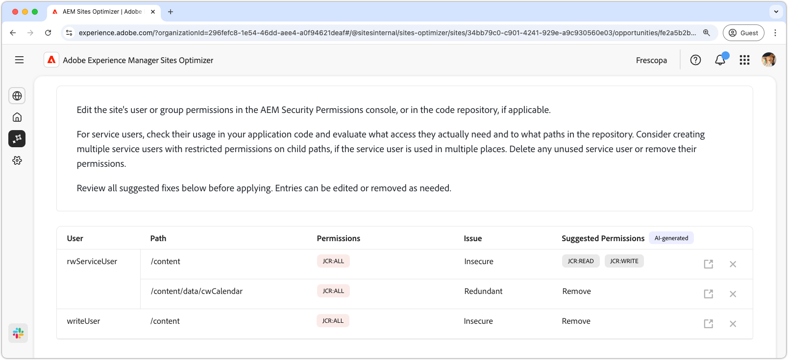

# Website permissions opportunity

{align="center"}

The website permissions opportunity optimizes website permissions, crucial for maintaining a secure and manageable AEM environment. This opportunity allows you to refine access controls by removing overly broad permissions—such as `jcr:all` on generic paths like `/` or `/content` — and aligning user access with the principle of least privilege. By streamlining permissions and eliminating redundancies, you can reduce security risks, improve maintainability, and prevent future misconfigurations. Take action by reviewing and updating permissions in the AEM Security Permissions console or your code repository, ensuring service users have only the access they truly need.

## Auto-identify

{align="center"}

The **Website Permissions opportunity** feature automatically identifies and lists 

* **User** – The user account with the suspect permission.
* **Path** – The path in AEM that is affected by the permission.
* **Permission** – The permission that is suspect.
* **Issue** - Indicates the type of issue impacting the permission.

## Auto-suggest

{align="center"}

Auto-suggest provides AI-generated recommendations in the **Suggested permissions** field, allowing you to replace any flagged permissions with secure alternatives.

## Auto-optimize [!BADGE Ultimate]{type=Positive tooltip="Ultimate"}

{align="center"}

Sites Optimizer Ultimate adds the ability to deploy auto-optimization for the vulnerabilities found.

>[!BEGINTABS]

>[!TAB Deploy optimization]

{{auto-optimize-deploy-optimization-slack}}

>[!TAB Request approval]

{{auto-optimize-request-approval}}

>[!ENDTABS]