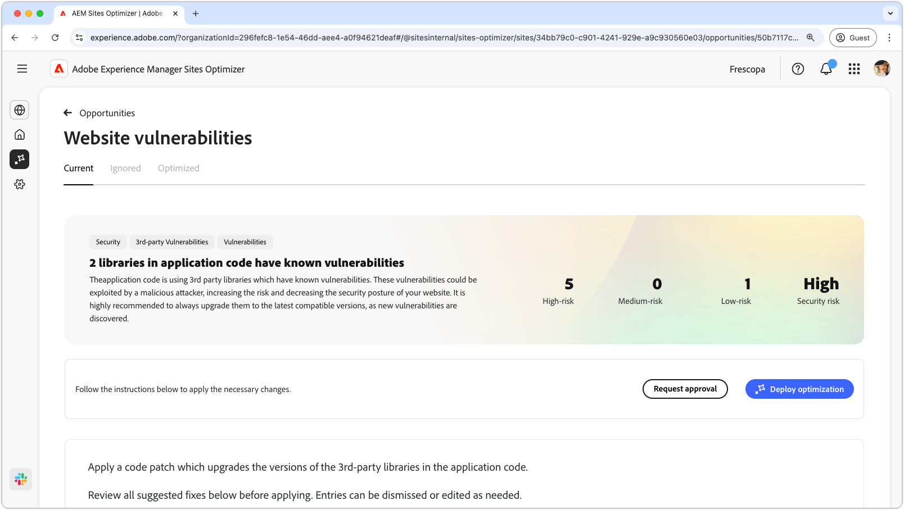
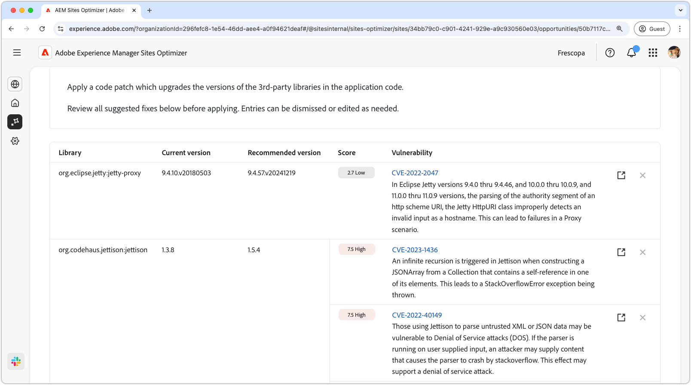
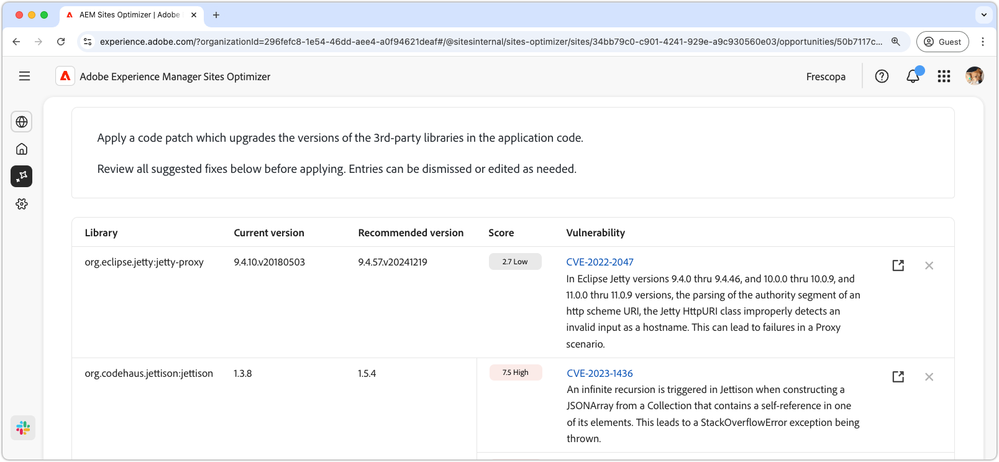
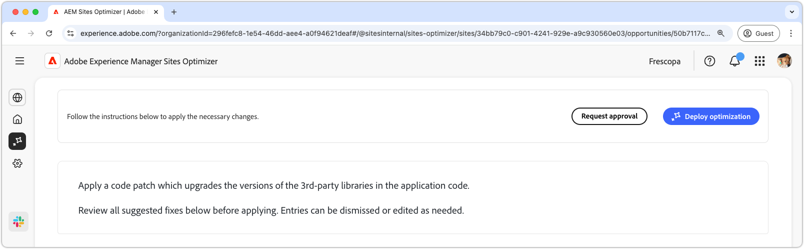

# Website vulnerabilities opportunity

The website vulnerabilities opportunity identifies security vulnerabilities in the 3rd party libraries used by your application code. These vulnerabilities could be exploited by a malicious attacker, increasing the risk and decreasing the security posture of your website.

The website vulnerabilities opportunity displays a summary at the top of the page, including the following:

* **Found issues** – The number of vulnerabilities found, categorized by the security risk they represent (low, medium, high).
* **Aggregated security risk** – The overall security risk to your website based on the vulnerabilities found by the opportunity.

## Auto-identify

The **Website Vulnerabilities Opportunity** feature automatically identifies and lists vulnerabilities found in third-party libraries used by your application code. It provides the following details:  

* **Library** – The third-party library containing the vulnerability. A single library may have multiple vulnerabilities.  
* **Current Version** – The version of the library currently in use.  
* **Recommended Version** – The suggested version that resolves the vulnerability.  
* **Score** – The severity rating of the vulnerability, also summarized at the top of the page.  
* **Vulnerability** – The vulnerability identifier, a brief description, and a link to the National Vulnerability Database (NVD) for more details. Access the NVD link by clicking the identifier or the link next to the description.  

## Auto-suggest

Auto-suggest provides AI-generated suggestions for the **Recommended version** of vulnerable library you should upgrade to. Each entry has a **Score** indicating its overall severity, helping prioritize the most critical vulnerabilities.

>[!BEGINTABS]

>[!TAB Vulnerability details]

Each vulnerability contains a link to the detailed information in the [National Vulnerability Database (NVD)](https://nvd.nist.gov/). Clicking on the vulnerability identifier or the link item to the right of the description will take you to the NVD page for that vulnerability.

>[!TAB Ignore entries]

You can choose to ignore entries from the vulnerability list. Selecting the **ignore icon** removes the entry from the list. Ignored entries can be re-engaged from the **Ignored** tab at the top of the opportunity page.<!---right now it does not seem to be implemented, but the page description mentions this functionality-->

>[!ENDTABS]

## Auto-optimize [!BADGE Ultimate]{type=Positive url="../licensing.md#sites-optimizer-ultimate" tooltip="Ultimate"}

Sites Optimizer Ultimate adds the ability to deploy auto-optimization for the vulnerabilities found.

>[!BEGINTABS]

>[!TAB Deploy optimization]

{{auto-optimize-deploy-optimization-slack}}

>[!TAB Request approval]

{{auto-optimize-request-approval}}

>[!ENDTABS]