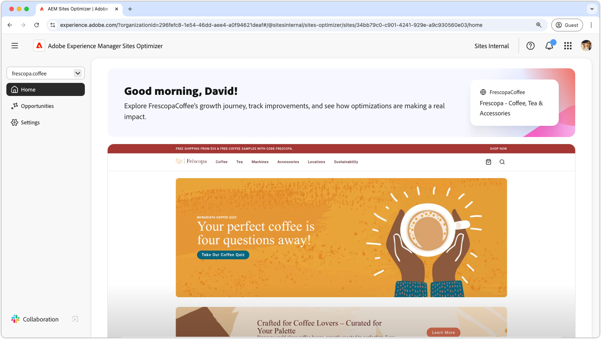
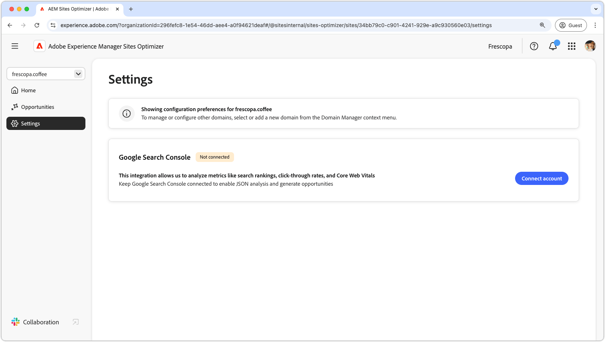

# Sites Optimizer documentation

Welcome to the Sites Optimizer documentation. Here you will find information on how to use Sites Optimizer to optimize your AEM sites.

## Site Optimizer basics

Explore the AEM Sites Optimizer documentation to learn about key UI components, including the Home dashboard, Settings configurations, and the Opportunities list for optimization insights.

<!-- CARDS 

* ./home.md
  {title = Home}
  {image = ./assets/home/card.png}
* ./opportunities/overview.md
  {title = Opportunities}
* ./settings.md
  {title = Settings}
* ./licensing.md
  {title = Licensing}
  {image = ./assets/licensing/card.png}

-->
<!-- START CARDS HTML - DO NOT MODIFY BY HAND -->

    

        

            

                <figure class="image x-is-16by9">
                    
                </figure>
            

            

                

                    

                        <a href="./home.md" target="_blank" rel="referrer" title="Home">Home</a>
                    

                    
Learn about the basics of Sites Optimizer and how to navigate it.

                

                <a href="./home.md" target="_blank" rel="referrer" class="spectrum-Button spectrum-Button--outline spectrum-Button--primary spectrum-Button--sizeM" style="align-self: flex-start; margin-top: 1rem;">
                    Learn more
                </a>
            

        

    

    

        

            

                <figure class="image x-is-16by9">
                    
                </figure>
            

            

                

                    

                        <a href="./opportunities/overview.md" target="_blank" rel="referrer" title="Opportunities">Opportunities</a>
                    

                    
Learn about all the available Site Optimizer opportunities and how to use them to improve your site's performance.

                

                <a href="./opportunities/overview.md" target="_blank" rel="referrer" class="spectrum-Button spectrum-Button--outline spectrum-Button--primary spectrum-Button--sizeM" style="align-self: flex-start; margin-top: 1rem;">
                    Learn more
                </a>
            

        

    

    

        

            

                <figure class="image x-is-16by9">
                    
                </figure>
            

            

                

                    

                        <a href="./settings.md" target="_blank" rel="referrer" title="Settings">Settings</a>
                    

                    
Learn how to configure Sites Optimizer settings and integrate with other tools.

                

                <a href="./settings.md" target="_blank" rel="referrer" class="spectrum-Button spectrum-Button--outline spectrum-Button--primary spectrum-Button--sizeM" style="align-self: flex-start; margin-top: 1rem;">
                    Learn more
                </a>
            

        

    

    

        

            

                <figure class="image x-is-16by9">
                    
                </figure>
            

            

                

                    

                        <a href="./licensing.md" target="_blank" rel="referrer" title="Licensing">Licensing</a>
                    

                    
Learn about Sites Optimizer Prime and Ultimate licensing and the features available in each tier.

                

                <a href="./licensing.md" target="_blank" rel="referrer" class="spectrum-Button spectrum-Button--outline spectrum-Button--primary spectrum-Button--sizeM" style="align-self: flex-start; margin-top: 1rem;">
                    Learn more
                </a>
            

        

    

<!-- END CARDS HTML - DO NOT MODIFY BY HAND -->

## Opportunities documentation

Sites Optimizer provides a set of opportunities to help you optimize your AEM sites. The opportunities each provide core functionality to help you optimize your sites. For more information.

<!-- CARDS 

* ./opportunities/overview.md
    {title=Opportunities}
* ./opportunities/broken-backlinks.md
    {title=Broken backlinks}

-->
<!-- START CARDS HTML - DO NOT MODIFY BY HAND -->

    

        

            

                <figure class="image x-is-16by9">
                    
                </figure>
            

            

                

                    

                        <a href="./opportunities/overview.md" target="_blank" rel="referrer" title="Opportunities">Opportunities</a>
                    

                    
Learn about all the available Site Optimizer opportunities and how to use them to improve your site's performance.

                

                <a href="./opportunities/overview.md" target="_blank" rel="referrer" class="spectrum-Button spectrum-Button--outline spectrum-Button--primary spectrum-Button--sizeM" style="align-self: flex-start; margin-top: 1rem;">
                    Learn more
                </a>
            

        

    

    

        

            

                <figure class="image x-is-16by9">
                    
                </figure>
            

            

                

                    

                        <a href="./opportunities/broken-backlinks.md" target="_blank" rel="referrer" title="Broken backlinks">Broken backlinks</a>
                    

                    
Learn about the broken backlinks opportunity and how to use it to improve traffic acquisition.

                

                <a href="./opportunities/broken-backlinks.md" target="_blank" rel="referrer" class="spectrum-Button spectrum-Button--outline spectrum-Button--primary spectrum-Button--sizeM" style="align-self: flex-start; margin-top: 1rem;">
                    Learn more
                </a>
            

        

    

<!-- END CARDS HTML - DO NOT MODIFY BY HAND -->

