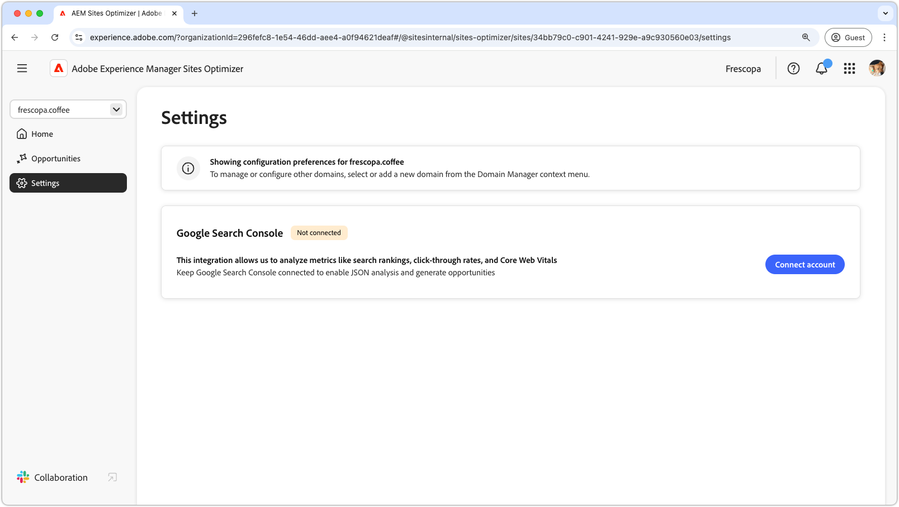
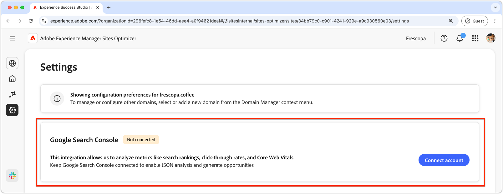

# Sites Optimizer settings

{align="center"} 

Site Optimizer settings is the central hub for configuring your Sites Optimizer experience. 

## Google Search Console

{align="center"}

The Google Search Console settings connector in AEM Sites Optimizer enables the analysis of key SEO metrics like search rankings, click-through rates, and Core Web Vitals. By keeping Google Search Console connected, you can leverage JSON analysis to uncover optimization opportunities and improve site performance. 

To set up this connector, you must have credentials with administrative access to Google Search Console for the domain.
