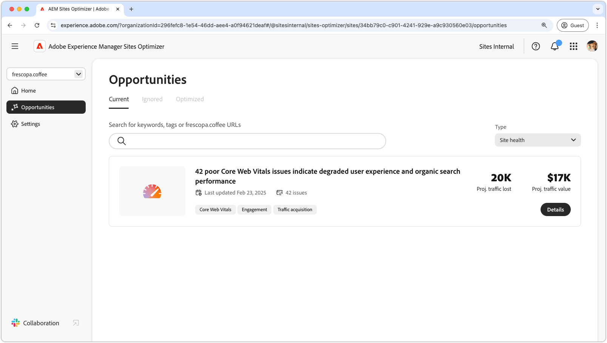

# Opportunity types

{align="center"}

AEM Sites Optimizer provides valuable insights and recommendations to help you improve your website's performance, usability, and security. These insights are grouped into key opportunity areas: Engagement, Traffic Acquisition, Security Posture, Site Health, and Form Optimization. Each category highlights specific ways to enhance your site, whether by increasing visitor interaction, improving discoverability, strengthening security, maintaining site stability, or optimizing form performance.

Leveraging these opportunities improves user experience, attracts the right audience, and keeps your site secure and reliable. Enhancing engagement and traffic acquisition drives interaction and visibility, while a strong security posture and site health help ensure trust and stability. Optimizing forms can also boost conversions. Explore the links below to see opportunities organized by category and discover ways to improve your site.

## Opportunities types

<!-- CARDS 

* ./traffic-acquisition.md
   { title = Traffic acquisition }
* ./engagement.md
   { title = Engagement }
* ./site-health.md
   { title = Site health }
* ./security-posture.md
   { title = Security posture }
* ./form-optimization.md
   { title = Form optimization }

-->
<!-- START CARDS HTML - DO NOT MODIFY BY HAND -->

    

        

            

                <figure class="image x-is-16by9">
                    
                </figure>
            

            

                

                    

                        <a href="./traffic-acquisition.md" target="_blank" rel="referrer" title="Traffic acquisition">Traffic acquisition</a>
                    

                    
Learn how to increase traffic acquisition with Sites Optimizer.

                

                <a href="./traffic-acquisition.md" target="_blank" rel="referrer" class="spectrum-Button spectrum-Button--outline spectrum-Button--primary spectrum-Button--sizeM" style="align-self: flex-start; margin-top: 1rem;">
                    Learn more
                </a>
            

        

    

    

        

            

                <figure class="image x-is-16by9">
                    
                </figure>
            

            

                

                    

                        <a href="./engagement.md" target="_blank" rel="referrer" title="Engagement">Engagement</a>
                    

                    
Learn how to improve engagement with Sites Optimizer.

                

                <a href="./engagement.md" target="_blank" rel="referrer" class="spectrum-Button spectrum-Button--outline spectrum-Button--primary spectrum-Button--sizeM" style="align-self: flex-start; margin-top: 1rem;">
                    Learn more
                </a>
            

        

    

    

        

            

                <figure class="image x-is-16by9">
                    
                </figure>
            

            

                

                    

                        <a href="./site-health.md" target="_blank" rel="referrer" title="Site health">Site health</a>
                    

                    
Learn how to improve your site's health with Sites Optimizer.

                

                <a href="./site-health.md" target="_blank" rel="referrer" class="spectrum-Button spectrum-Button--outline spectrum-Button--primary spectrum-Button--sizeM" style="align-self: flex-start; margin-top: 1rem;">
                    Learn more
                </a>
            

        

    

    

        

            

                <figure class="image x-is-16by9">
                    
                </figure>
            

            

                

                    

                        <a href="./security-posture.md" target="_blank" rel="referrer" title="Security posture">Security posture</a>
                    

                    
Learn how to improve your site's security with Sites Optimizer.

                

                <a href="./security-posture.md" target="_blank" rel="referrer" class="spectrum-Button spectrum-Button--outline spectrum-Button--primary spectrum-Button--sizeM" style="align-self: flex-start; margin-top: 1rem;">
                    Learn more
                </a>
            

        

    

    

        

            

                <figure class="image x-is-16by9">
                    
                </figure>
            

            

                

                    

                        <a href="./form-optimization.md" target="_blank" rel="referrer" title="Form optimization">Form optimization</a>
                    

                    
Learn about Form Optimization with Sites Optimizer.

                

                <a href="./form-optimization.md" target="_blank" rel="referrer" class="spectrum-Button spectrum-Button--outline spectrum-Button--primary spectrum-Button--sizeM" style="align-self: flex-start; margin-top: 1rem;">
                    Learn more
                </a>
            

        

    

<!-- END CARDS HTML - DO NOT MODIFY BY HAND -->
