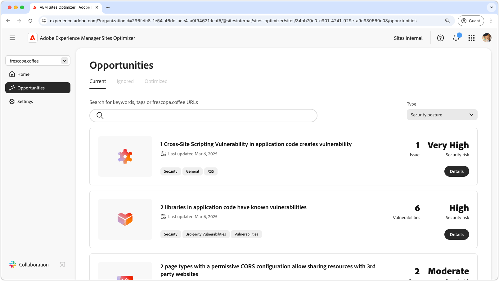

# Security posture opportunities

{align="center"}

Learn how Sites Optimizer can help you improve your site's security posture.

## Opportunities

<!-- CARDS

* ../documentation/opportunities/cross-site-scripting.md
   { title = Cross-site scripting }

-->
<!-- START CARDS HTML - DO NOT MODIFY BY HAND -->

    

        

            

                <figure class="image x-is-16by9">
                    
                </figure>
            

            

                

                    

                        <a href="../documentation/opportunities/cross-site-scripting.md" target="_blank" rel="referrer" title="Cross-site scripting">Cross-site scripting</a>
                    

                    
Learn about the cross-site scripting opportunity and to identify and fix site security vulnerabilities.

                

                <a href="../documentation/opportunities/cross-site-scripting.md" target="_blank" rel="referrer" class="spectrum-Button spectrum-Button--outline spectrum-Button--primary spectrum-Button--sizeM" style="align-self: flex-start; margin-top: 1rem;">
                    Learn more
                </a>
            

        

    

<!-- END CARDS HTML - DO NOT MODIFY BY HAND -->
