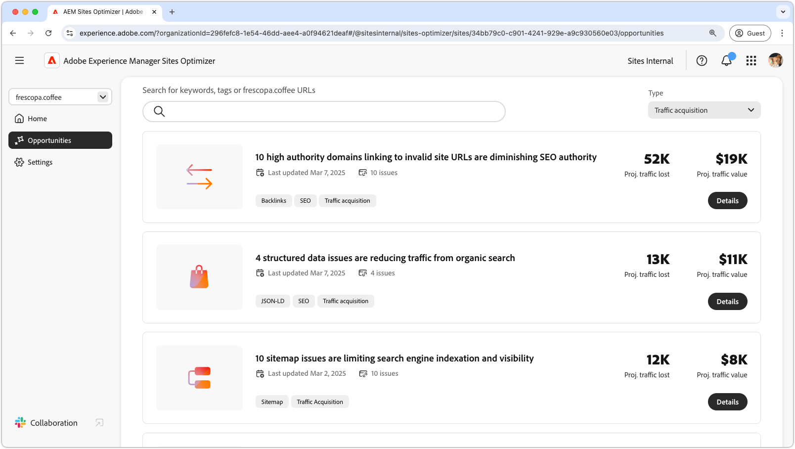
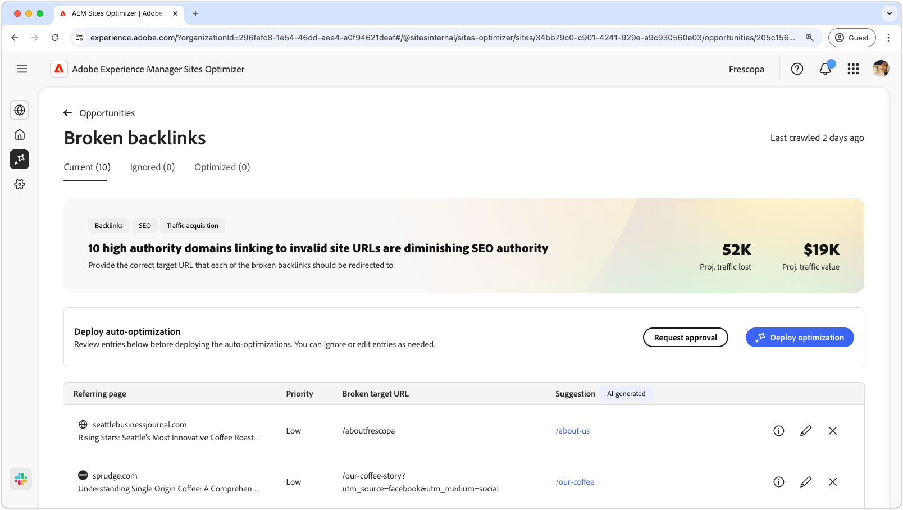

# Traffic acquisition opportunities

{align="center"}

Traffic acquisition is crucial because it brings potential customers to your website, giving you opportunities to generate sales or leads. Search engine optimization (SEO) plays a big role in this by helping your site appear higher in search results, making it easier for people to find you. Without a steady flow of visitors, even the best products or services can go unnoticed. More traffic also provides valuable insights into what people are looking for, helping you refine your offerings and improve the user experience. Additionally, a well-visited website builds brand awareness and trust, making it easier to convert visitors into loyal customers.

## Opportunities 

<!-- CARDS

* ../documentation/opportunities/broken-backlinks.md 
    { title = Broken backlinks }
    { description = Learn how to fix broken backlinks on your site increasing SEO and site traffic. }

-->
<!-- START CARDS HTML - DO NOT MODIFY BY HAND -->

    

        

            

                <figure class="image x-is-16by9">
                    
                </figure>
            

            

                

                    

                        <a href="../documentation/opportunities/broken-backlinks.md" target="_blank" rel="referrer" title="Broken Backlinks Opportunity Documentation">Broken backlinks</a>
                    

                    
Learn how to fix broken backlinks on your site increasing SEO and site traffic.

                

                <a href="../documentation/opportunities/broken-backlinks.md" target="_blank" rel="referrer" class="spectrum-Button spectrum-Button--outline spectrum-Button--primary spectrum-Button--sizeM" style="align-self: flex-start; margin-top: 1rem;">
                    Learn more
                </a>
            

        

    

<!-- END CARDS HTML - DO NOT MODIFY BY HAND -->
