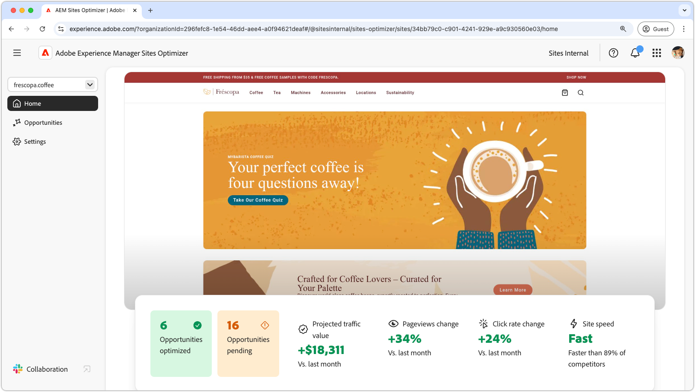

# AEM Sites Optimizer

{align="center"}

Adobe Experience Manager (AEM) Sites Optimizer is a cloud-based service that analyzes and improves the performance of websites built on AEM. It identifies areas where page loading, component usage, and content delivery can be improved, helping customers enhance their website's performance and reduce maintenance and update costs. By using Sites Optimizer, customers can ensure a smooth and reliable online experience, which is important for maintaining engagement and conversions.

## Everything you need to know about Sites Optimizer

<!-- CARDS 

* ./opportunity-types/overview.md
   {title=Opportunities}
   {description = Learn about the available Site Optimizer opportunities and how to use them to improve your site's performance.}
* ./documentation/overview.md
  * {title=Documentation}
  * {description=Explore the Sites Optimizer documentation to learn about all its capabilities.}

-->
<!-- START CARDS HTML - DO NOT MODIFY BY HAND -->

    

        

            

                <figure class="image x-is-16by9">
                    
                </figure>
            

            

                

                    

                        <a href="./opportunity-types/overview.md" target="_blank" rel="referrer" title="Opportunities">Opportunities</a>
                    

                    
Learn about the available Site Optimizer opportunities and how to use them to improve your site's performance.

                

                <a href="./opportunity-types/overview.md" target="_blank" rel="referrer" class="spectrum-Button spectrum-Button--outline spectrum-Button--primary spectrum-Button--sizeM" style="align-self: flex-start; margin-top: 1rem;">
                    Learn more
                </a>
            

        

    

    

        

            

                <figure class="image x-is-16by9">
                    
                </figure>
            

            

                

                    

                        <a href="./documentation/overview.md" target="_blank" rel="referrer" title="Documentation">Documentation</a>
                    

                    
Explore the Sites Optimizer documentation to learn about all its capabilities.

                

                <a href="./documentation/overview.md" target="_blank" rel="referrer" class="spectrum-Button spectrum-Button--outline spectrum-Button--primary spectrum-Button--sizeM" style="align-self: flex-start; margin-top: 1rem;">
                    Learn more
                </a>
            

        

    

<!-- END CARDS HTML - DO NOT MODIFY BY HAND -->
